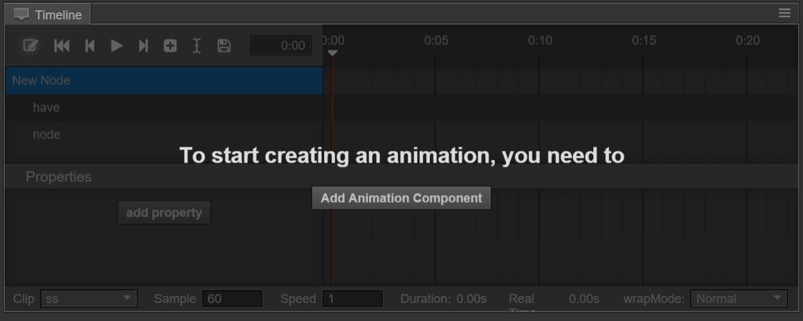
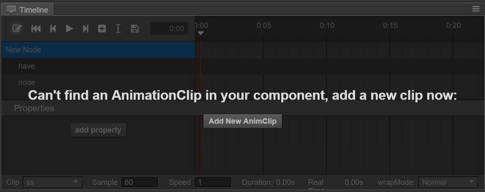

# Create Animation components and animation clips

## Create an Animation component

We can add different components to each node. If we want to create an animation on a node, we must create a new Animation component for it.
There are 2 methods for creating an animation:

1、Choose the corresponding node, click `+` on the top right corner or `Add component` below in the property checker and choose Animation in other components.

2、Open the animation editor, choose the node that you want to add the animation to in the arrangement manager and click the `Add Animation component` button in the animation editor.

## Create and mount anination clips

Now we have an Animation component on the node, but we don't have the corresponding animation clip data. Also, there are 2 methods for creating an animation clip:

1、Click `+` on the top left corner in the resource manager or right click the blank area, then choose Animation Clip. A clip document named 'New AnimationClip' will now be created in the manager.
Only the creation of it is not enough. We click and choose the node in the arrangement manager again, find Animation in the property checker. The value of Clips is 0 now. We change it to 1.
Then we drag the newly created 'New AnimationClip' from the resource manager into the newly emerged `animation-clip choice box`.

2、If the Animation component hasn't been added to any animation clip document, we can directly click the `Create an animationClip` button in the animation editor, and create a new animation clip document according to the pop up window.
What we need to pay attention to is that if we choose to cover the existing clip document, the content of the covered document will be cleared up.

Now we have finished the preparation work before creating animations. Next we will create animation curves.

---

Continue to read [animation-curve.md]