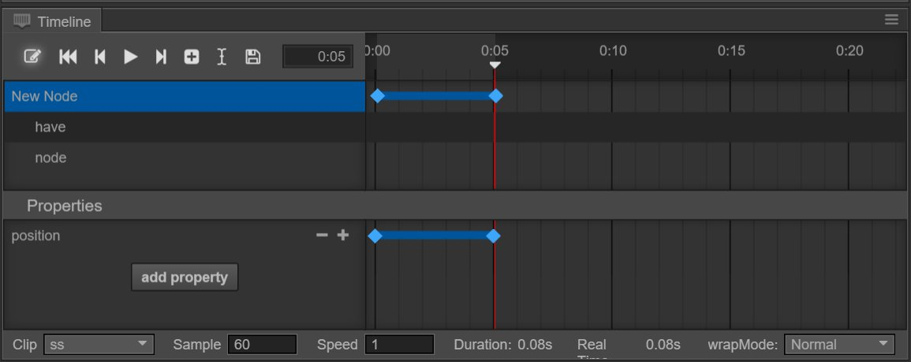
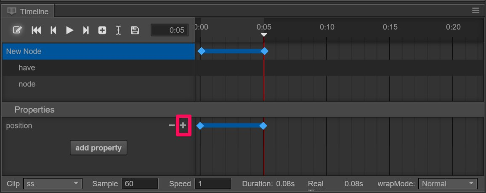
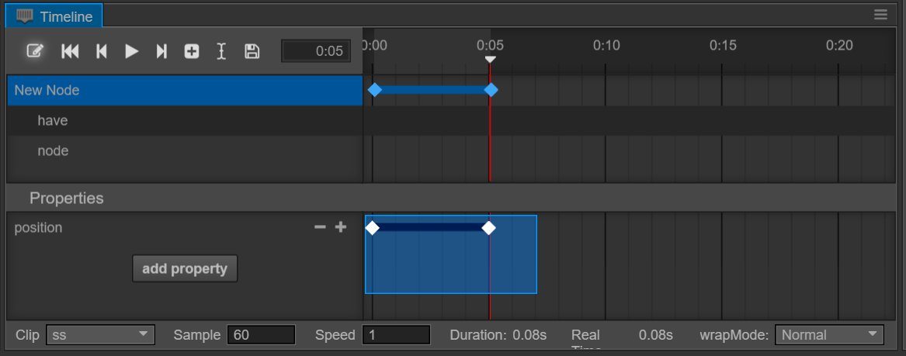

# Edit animation curve

We have just mounted animation clips to the node. Now we can create some animation curves in animation clip.

Firstly, we learn about animation properties. Animation properties include node's self-existent properties like `position`, `rotation`, etc., and user-defined properties in Component.
Properties included in component will add the name of component to the beginning of its name, such as: `cc.Sprite.spriteFrame`.

For example, in the picture above, the curve of position is property path and the corresponding blue dots are animation frames.

## Add a new property path

For the normal adding method, we need to first choose the node and then click `add property` in the property field.
In the pop up menu, all the addable properties will be listed. Choose the property that you want to add and a corresponding path will be added.

You can also directly modify the corresponding properties of the node in recording status.Open recording status (the red circle on the top left corner) in switch and directly drag the currently chosen node in scene editor. An `add property` path will be added correspondingly to the property list and a key frame will be added to the current timeline.Also, in recording status, direct modifications of other properties in the property checker will automatically add the property path and key frame.

## Delete a property path

Right click a property in property list and choose `delete` option in pop up menu, the corresponding property will be deleted from animation data.

## Add an animation frame

Just now, we said that direct modifications of properties in recording status can automatically add corresponding properties and frames. 
You can also directly click `+` sign on the right side of corresponding property in property list, then a frame will be added to the currently chosen time point.

## Choose an animation frame

Click the created sequence frame and it will display in the checked state. Now the sequence frame will turn from blue to white. If you need to choose multiply, you can press down ctrl button and choose other sequence frames or directly drag and circle them in the property field.

## Move an animation frame

Now, if we move the mouse to any chosen node, the mouse will display left and right arrows, then you can drag all the chosen nodes by pressing down the left mouse button.

## Modify an animation frame

Click the animation frame that needs to be modified, and the chosen frame on timeline will jump to this frame. After making sure the recording status is opened, you can directly modify corresponding properties in the property checker. 

## Delete an animation frame

After choosing a sequence frame, click `-` sign in property field, then the currently chosen sequence frame will be deleted. Or directly press down delete button on the keyboard, then all the chosen nodes will be deleted.

---

Continue to read [sprite-animation.md].