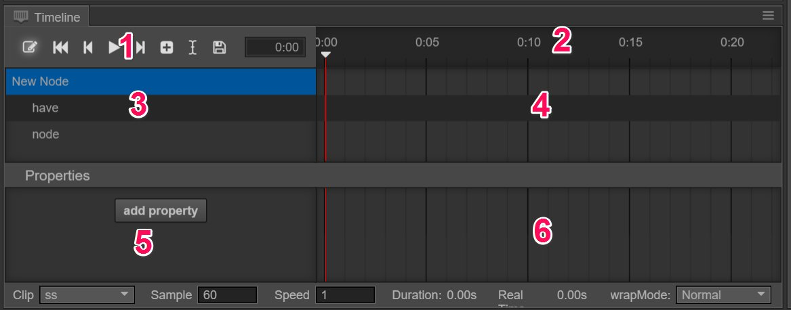

# About Animation

## Animation components and Animation clips
Cocos Creator is a componentized structure. Animation is no exception, it is a component in the Node. Animation clips, however, are documents for saving animation data. Animation clips need to be mounted to Animation components to enable the engine to smoothly apply animation data to the Node.

## Understanding animation editor
The Animation editor can be divided into 7 parts.

1,Common button field, which displays some common functional buttons, such as: (from left to right) recording status switch, back to the first frame, last frame, play/stop, next frame, create a new animation clip and insert animation event.

2,Timeline and event, which mainly displays timeline. The added user defined events will display here too.

3,Hierarchy management(node tree), which includes node data that can be influenced by the current animation clip.

4,The preview field of the animation frame in nodes, which mainly displays the preview timeline of all the frames in each node.

5,Property list, which displays the property lists of the currently chosen node that has been included in the chosen animation clip.

6,Key frame. The frame corresponding to each property will display here.

7,Basic properties of animation clip. After choosing the animation clip, the basic data will display here and can be modified.

## Basic operation

### Modify the zoom proportion of timeline
Scroll the mouse wheel in area 2, 4, 6 of the image, and the display percentage of the timeline can be zoomed in/out.

### Modify the display area of timeline
1. Press Shift button on the keyboard, left-click area 2, 4, 6 in the image and drag it to the left/right.

2. Press down the middle mouse button in area 2, 4, 6 in the image and drag it.

### Modify the currently chosen timeline node

1. Click or drag any position in the timeline (area 2) area, you can modify the current time node.

2. Drag the marked red line in area 4.

### Open/close recording status

1. There is a red button on the left side of graph 1. Click it and you will open/close the recording status.

2. The adding and deletion of the property frame and path will automatically open the recording status.

3. The playing of the animation will automatically open the recording status.

4. When playing, operations like saving the scene, etc., will close the recording status.

### Play/stop animation

1. Click the Play button in graph 1, which will automatically turn into Stop. Click the button again and the animation will be stopped.

2. When playing, operations like saving the scene, etc. will stop playing.

---

Continue on to read about [Creating Animation component and animation clip](animation-clip.md).
