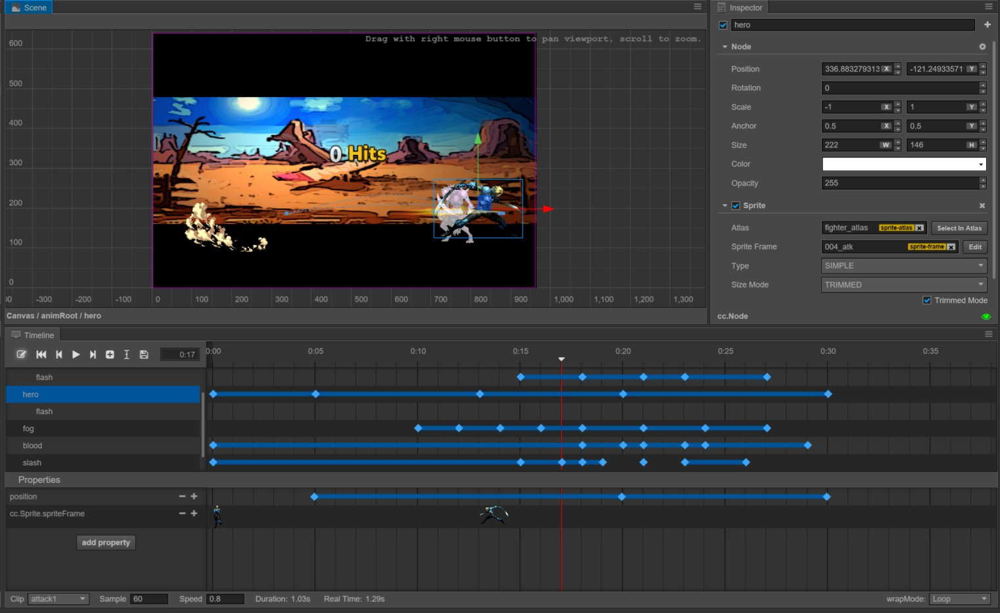

# Animation system
This chapter will introduce the animation system of Cocos Creator. Apart from standard
movement, rotation, zooming in/out of animation and sequence frame animation, this
set of animation systems also supports the drive of arbitrary component properties
and user-defined properties. Adding a time curve that can be edited arbitrarily and
the innovative function of editing the movement path, it can help content creators
create various complicated and exquisite dynamic effects without writing a single
line of code.

- [animation.md]
- [animation-clip.md]
- [animation-curve.md]
- [sprite-animation.md]
- [time-curve.md]
- [animation-event.md]
- [scripting-animation.md]

Start learning from [animation.md].
