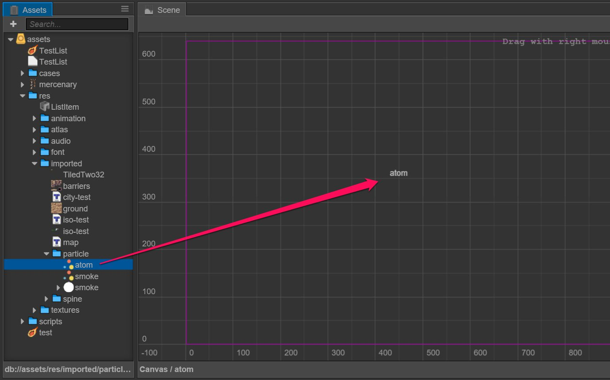

# Particle System

## Import particle asset

Put the particle `.plist` file that Cocos2d supports directly under the project catalogue.

## Add particle system to the scene

Method one, drag particle assets directly from **assets** to **hierarchy manager**:

Method two, drag particle assets directly from **assets** to **scene editor**:

Method three, add a **ParticleSystem** component on the existing node and give particle assets to the component `File` attribute from **assets**:

Keep moving on to the [audio asset](audio-asset.md) file.
