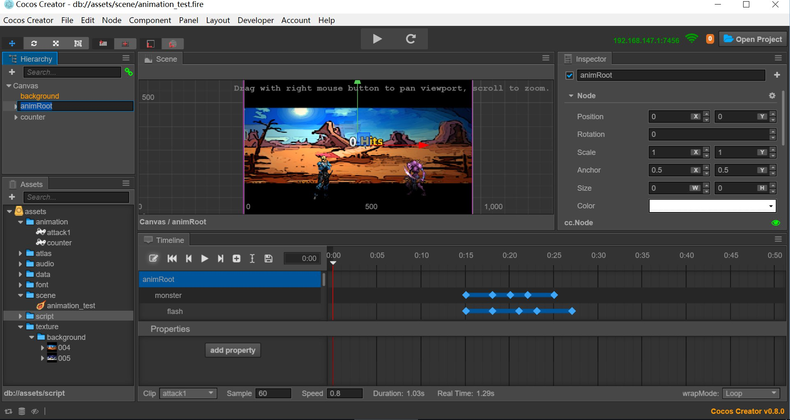
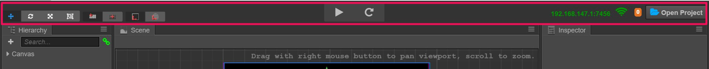

# Editor interface overview

This chapter will introduce the editor interface and get familiar with each of the panels, menus and functional buttons that make up the editor. Cocos Creator editor is composed of multiple panels which can be moved and combined freely to meet the needs of different projects and developers. Here we will take the default editor layout as an example to quickly browse the name and function of each panel:

## Asset manager

**Asset manager** shows all the assets in the project asset file（`assets`）. It will show the folder in dendritical structure and auto-sync the content changes in the project resource folder from the operating system. You can drag files in from the outside or use the menu to import resources.

For further information please read the [asset manager](editor-panels/assets.md) section.

## Scene editor

**Scene editor** is used to show and edit the visible working area in the scene. WYSIWYG scene building work is all done depending on the display in the scene editor.

For further information please read the [scene editor](editor-panels/scene.md) section.

## Hierarchy manager

**Hierarchy manager** displays all the nodes and their hierarchy in the form of a listtree. For all the content you can see in the **scene editor**, the corresponding node entry can be found in the **hierarchy manager**. The content in these two panels when editing the scene will synchronize the display and we normally use these two panels at the same time to build the scene.

For further information please read [hierarchy manager](editor-panels/hierarchy.md) section.

## Attribute inspector
 

**Attribute inspector** is the working area where we view and edit the currently selected node and component attribute. This panel will display and edit the attribute data defined by the script in the most suitable way.

For further information please read the [attribute inspector](editor-panels/inspector.md) section.

## Toolbar

**Toolbar** includes the scene editing tool and operating button for game preview. The far right side shows the access address for remote testing and debugging and the device number of the connected device.

For further information please read the [toolbar](toolbar.md) section.

