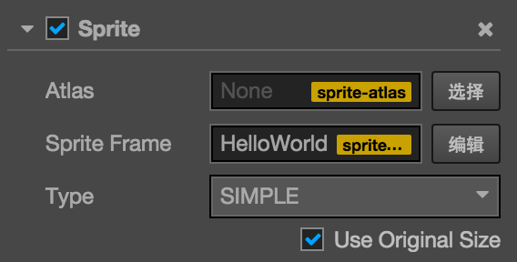

# Sprite component reference

Sprite is the most common way to display images in a 2D game. Add Sprite component to the node and then the images in the project resource can be showed in the scene.

Click `add component` button at the bottom of **attribute inspector** and then select `Sprite` from `add rendering component` so you can add Sprite component to the node.

## Sprite attribute

| Attribute |   Function Explanation
| -------------- | ----------- |
| Atlas | [Atlas resource](asset-workflow/atlas.md) which the Sprite's display image resource belongs to
| Sprite Frame | [SpriteFrame image resource](asset-workflow/sprite.md) which is used to render the Sprite
| Type | Rendering mode, currently includes Simple and Sliced rendering modes
| Use Original Size | Whether to use the original size of the image resource as the Sprite node size

## Detailed explanation

After adding the Sprite component, drag the Texture or SpriteFrame type resource from **resource manager** to the `Sprite Frame` attribute reference, then the resource image can be showed through the Sprite component.

If the SpriteFrame resource being dragged is contained in an Atlas resource, then the `Atlas` attribute of Sprite will be set along with it. Later you can click the **choose** button next to `Atlas` attribute to choose another SpriteFrame from this Atlas to assign to the Sprite.

### Rendering mode

Currently, the Sprite component support two rendering modes:

- Simple mode: rendering the Sprite according to the original image resource, is normally used along with `Use Original Size` to guarantee the image shown in the scene is in full accord with the image the graphic designer designed.
- Sliced mode: image is being sliced into sudoku and zoom according to certain rules to fit free set `size`. Usually used in UI elements or makes images that can be enlarged infinitely without influence on the image quality into a sudoku image to save game resource space. Please read [use Sprite editor to make sudoku image](../asset-workflow/sprite.md#-sprite-) for detailed information.

---

Keep moving on to [Label component reference](label.md).
 