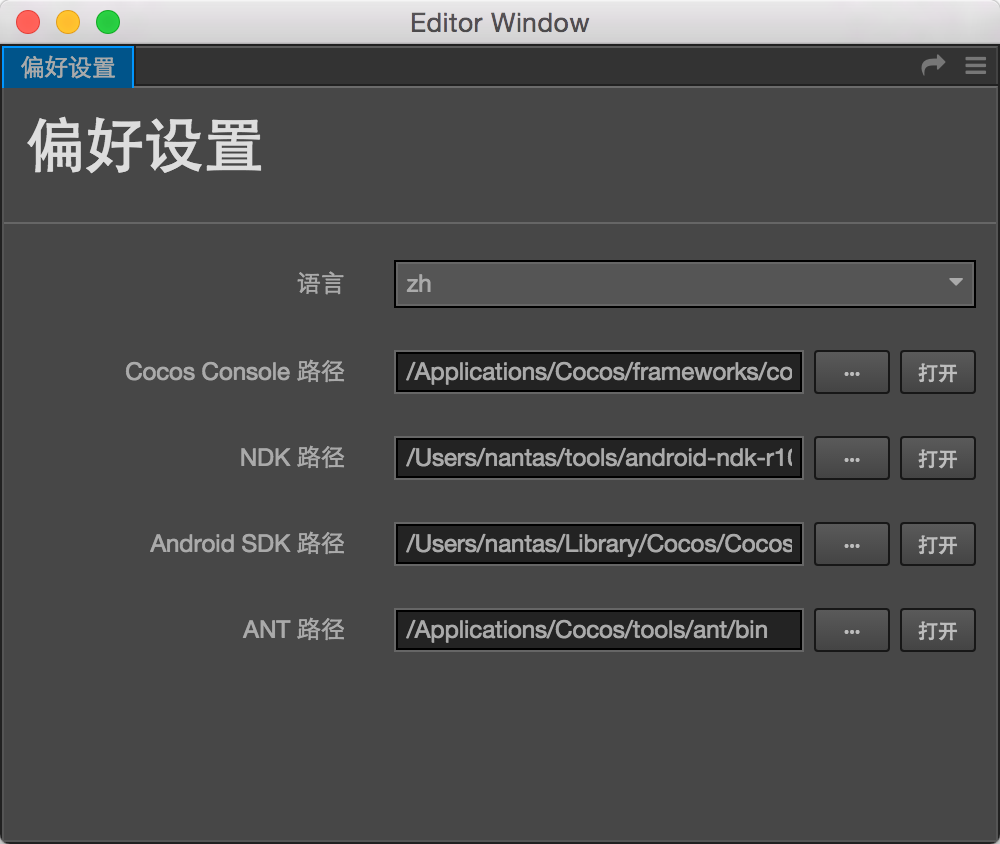

# Install and configure Cocos Framework

Apart from the built-in game release function of Web version, Cocos Creator uses the JSB technology that based on Cocos2d-x engine to realize the transplatform release of original applications and Cocos Play smartphone web-based games. Before using Cocos Creator to zip and send games to original platform, firstly we need to configure the Cocos Framework and related development environment.

## Download and install Cocos Framework

**Cocos Framework** is the pre-compiled version of Cocos2d-x engine. It has the advantages of compact size, free of compilation and easy installation when comparing with the complete version. Currently, the latest version of Cocos2d-x engine is v3.9. The followings are download links for Cocos Framework of v3.9 version:

- [Cocos Framework v3.9 Windows version](http://cocostudio.download.appget.cn/Cocos/CocosStore/CocosFramework-V3.9-Windows.exe)
- [Cocos Framework v3.9 Mac version](http://cocostudio.download.appget.cn/Cocos/CocosStore/CocosFramework-V3.9-Mac.pkg)

Run the installation package after downloading. Install it according to the instructions.

When installing Cocos Framework Windows version, you can choose the target path. Mac version will be installed under `/Applications/Cocos/frameworks` by default. Please confirm the installation path of your Cocos Framework; because we need to configure it in Cocos Creator later.

## Download SDK and NDK that are needed by Android platform release

If you didn't have a plan of releasing on the Android platform, or you had already had a complete Android development environment in your operating system, you can skip this part.

Download Android SDK and NDK that are in accordance with your operating system from the following links:

- [Android SDK Windows](http://cocostudio.download.appget.cn/Cocos/CocosStore/Android-SDK-Windows.zip)
- [Android SDK Mac](http://cocostudio.download.appget.cn/Cocos/CocosStore/android22-sdk-macosx.zip)
- [Android NDK Windows 32 Bit](http://cocostudio.download.appget.cn/Cocos/CocosStore/android-ndk-r10d-windows-x86.zip)
- [Android NDK Windows 64 Bit](http://cocostudio.download.appget.cn/Cocos/CocosStore/android-ndk-r10e-Windows.zip)
- [Android NDK Mac](http://cocostudio.download.appget.cn/Cocos/CocosStore/android-ndk-r10e-macosx.zip)

Please unzip them into an arbitrary position after downloading, because we need to set up the path of Android SDK and NDK later. Please remember the unzipped positions of the above documents.

## Install C++ compiling environment

The compiling tool Cocos Console in Cocos Framework needs the following running environment:

- Python 2.7.5+, [download page](https://www.python.org/downloads/). Pay attention! Don't download Python 3.x version.
- In Windows, the installation of Visual Studio 2013 or 2015 Community Edition is needed, [download page](https://www.visualstudio.com/downloads/download-visual-studio-vs)
- In Mac, the installation of Xcode and command line tool is needed, [download page](https://developer.apple.com/xcode/download/)

## Configure path in original release environment

Next, let's go back to Cocos Creator to configure the environmental path of constructing the original release platform. Choose `document/preference` in the main menu, and open the window of preference:



We need to configure the following four paths here:

- **Cocos Console**, which is normally in the `/tools/cocos2d-console/bin` directory under Cocos Framework. The chosen path should include an executable file named `cocos`.
- **NDK**, choose the NDK path that has just been downloaded and unzipped. You can skip this if you don't need to compile Android platform
- **Android SDK**, choose the Android SDK path that has just been downloaded and unzipped. You can skip this if you don't need to compile Android platform
- **ANT**, which will be put in the `tools` directory after installing Cocos Framework, which is at the same hierarchy as `frameworks`. The chosen path should include an executable file named `ant`.

Close the window after configuration is completed.

## Notes

Because we have received lots of feedbacks about original packing in public beta, some possible reasons are supplemented here:

1. Check the path

    The path set up in preferred settings should be guaranteed to be correct, for example: the path of ant should be set under the bin directory in the installation directory of ant, the root directory of which is NDK; and the directory of Android SDK should include documents like build-tools, platforms, etc..

2. Check NDK version

    No matter what version's engine is used, you must use versions later than NDK r9b. If Cocos2d-x framework is used, please use versions later than NDK r10, and r10e version is recommended.

3. On Windows platform, JAVA_HOME environmental variables need to be checked

    If using Windows platform, please confirm JAVA_HOME is included in your environmental variables. By right clicking My Computer, choosing property and opening the advanced tab, you can check and modify environmental variables. On Windows platform, you might need to restart the computer for taking effect.

4. Check JAVA environment

    Input the following code into Mac terminal or Windows command line tool to check:

    ```
    java -version
    ```

    If it displayed JAVA SE, there is no problem. If JRE was used in the system, then you need to install [JAVA SE running environment](http://www.oracle.com/technetwork/java/javase/downloads/index.html).

5. Check if the C++ compiling environment is correctly installed in Visual Studio
    
    When installing Visual Studio, the C++ compiling component is not ticked off by default. If Visual Studio wasn't installed, you need to reinstall and choose compiling components concerning C++.

6. Package name issue

    Check the package name in constructing release panel. Package names that include blank space, `-`, etc. are all illegal.

In the end, if zipping still failed, you can try to create a standard Cocos2d-x project and compile it. If the Cocos2d-x project was compilable and Cocos Creator couldn't be zipped, please send the bug to us by [forum](http://www.cocoachina.com/bbs/thread.php?fid-71.html).

---

Now you have finished all the configurations for the original development environment. Next, please continue to read the introductory document of [publish-native.md].


