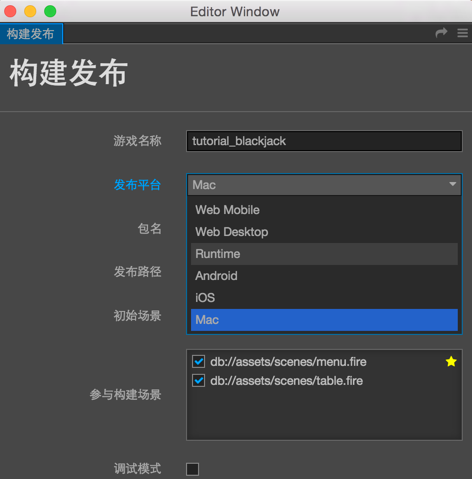
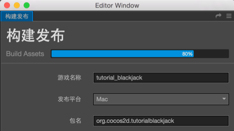
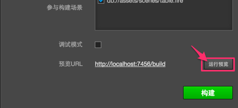
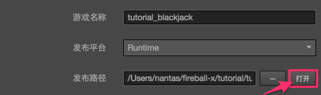

# Zip and release game on original platform

Open `document/constructing release` of main menu, and open the window of constructing release.

Currently, there are five original platforms that can be chosen from, which include: Cocos Runtime, Android, iOS, Mac and Windows. The options of releasing on Mac and Windows will only appear in relative operating systems.



## Configure Package Name

After choosing an original platform, an input field named **package name** will appear in the constructing release window, into which you can input the package name of your game (it's also called Package Name or Bundle ID). Package name is usually arranged in the reverse order of the website url of product, such as: `com.mycompany.myproduct`.

Only numbers, letters and underlines can be included in package name. Besides, the last section of package name should start with a letter, but not an underline or a number.


## Construct original project

After choosing the release platform and setting up the package name and the initial scene, the project can now be constructed. Click the **construct** button on the bottom right corner, and start constructing workflow.



When compiling scripts and zipping resources, a progress bar will display on the top of the window. After the progress bar has reached 100%, please continue to wait unitl the construction of the project in **console** ends. If it's successful, the diary as showed below will display:

```bash
Built to "/myProject/tutorial-blackjack/build/tutorial-blackjack" successfully
```

Next, you can choose to directly open the original preview provided by Cocos Creator, or manually open the constructed original project in IDE of corresponding platform for further preview, adjustment and release.

## Directly run preview

Click the **preview** button on the bottom right corner, you can preview the game of the original platform by the default method provided by Cocos Framework.



On Mac/iOS/Windows platform, Cocos Simulator will be used to preview the game on the desktop. On Android platform, you can preview only after connecting your computer with smartphone by USB port and opening USB test on your computer.

After clicking preview, a part of the constructing work will be continued, the real time progress of which will be seen on the console.

## Use original project



Click the **open** button adjacent to the release path, the constructing release path will be opened in the document manager of the operating system.

`jsb` of this path includes all the original constructing projects.


The red frames in the picture indicate projects of different original platforms. Next, only by using IDE(such as: Xcode、Eclipse、Visual Studio) that corresponds to the original platform to open these projects, can you make further operations like compilation, preview and release. For the usage instructions for IDE of the original platform, please search related information by your own, which will not be discussed in detail here.


