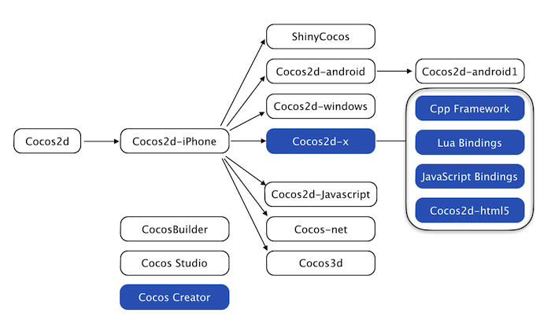

# Cocos2d系列产品关系

自Cocos2d-iPhone取得成功后，Cocos2d系列产品已经推出许多子项目，其中Cocos2d-x在全球范围内流行最广。这里列出了一些最为出名的分支游戏引擎。



蓝色方框中的分支引擎和编辑器活跃度最高，其中Lua Bindings, JavaScript Bindings以及Cocos2d-html5被完全整合进入Cocos2d-x。融合版本的Cocos2d-x允许开发人员利用C++、Lua及Javascript来进行游戏开发，使用可视化编辑器Cocos Creator，实现快速原型构建，调试打包，支持跨平台部署，覆盖平台包括iOS、Android、Windows Phone，Web及Tizen等等，省事省力省成本，让游戏开发更简单。

从下表可知，不同分支引擎支持不同的目标平台并使用不同的编程语言。

|分支引擎 | 编程语言 | 平台 |
|---|---|---|
|Cocos2d-x|C++, Lua, JavaScript	|iOS, Android, Windows Phone, Web, Tizen|
|Cocos2d|Python	|桌面操作系统|
|Cocos2d-iphone|Objective-C, JavaScript|iOS|
|Cocos2d-html5|JavaScript|支持HTML5的浏览器|
|ShinyCocos|Ruby|iOS|
|Cocos2d-windows|C++|Windows XP/7|
|Cocos2d-android|Java|	Android|
|Cocos2d-android-1|Java|	Android|
|Cocos2d-xna|C#	|Microsoft and MonoGame platforms|
|Cocos2d-javascript|JavaScript|	Web|
|Cocos-net|C#|Mono-supported 平台|
|Cocos3d|Objective-C|iOS|


