# Cocos 引擎 Tizen 开发者指南
## 搭建 Tizen 开发环境
### 环境需求
- Windows，OS X 或者 Ubuntu
- Cocos2d-x v3.11 [http://cocos2d-x.org/download](http://cocos2d-x.org/download )
- Tizen 2.4 Rev3+ SDK [ https://developer.tizen.org/development/tools/download](https://developer.tizen.org/development/tools/download )
- JDK 版本 8.0+ [JDK 下载地址](http://www.oracle.com/technetwork/java/javase/downloads/jdk8-downloads-2133151.html)

### 准备工作
- 下载 Cocos2d-x 3.11 版本
- 下载 Tizen SDK 安装器
- 下载正确的 JDK 版本

### 详细安装过程
- 首先安装 JDK，如果你的系统上面已经安装好了，则这一步可以跳过。

- 下载 Tizen SDK 安装器，根据你的系统去选择下载对应的版本。下载地址在__环境需__求小节可以找到。

- 双击下载好的 Tizen 安装器，然后根据安装界面提示去安装 Tizen SDK

  

- 安装完成后，点击‘Done’按钮；当提示你是否要运行 __Update Manager__ 的时候，选择"Yes(Y)"。

- 选择 __2.4 Mobile__ 旁边的下载按钮来下载 Tizen SDK 2.4 native IDE 和命令行工具

- 下载完成以后，你就可以在安装目录（默认安装在~/tizen-sdk 目录）下面的 ide 目录找到 IDE.app 来运行 Tizen IDE 了。

## 运行引擎测试例(以 Cpp-tests 为例，其它测试例类似)
### 导入 libcocos2dx 库工程
右键点击__Project Explorer__，选择__Import...__：

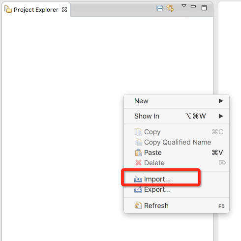

在弹出的对话框中选择 __General__ -> __Existing Projects into Workspace__, 并点击__Next__:

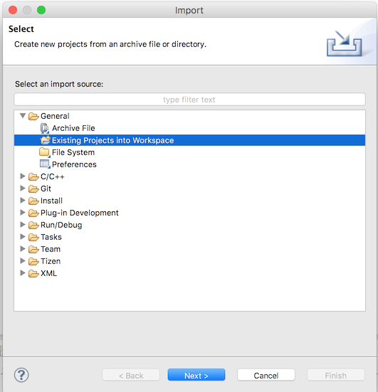

然后选择__Browse...__找到路径__$Cocos2dHome/build/tizen__ (这里的$Cocos2dHome 指代你下载好的引擎的路径）:

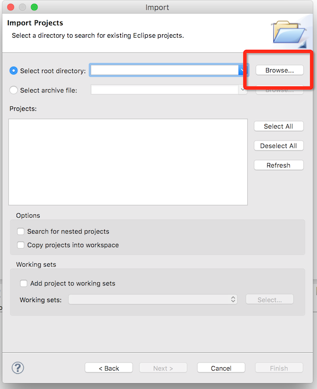

导入操作完成后，你应该会得到如下界面：

最后，点击__Finish__来关闭对话框。到这里，我们的库工程就成功导入了。

### 编译引擎库工程
- 设置库工程的编译选项

右键点击 __libcocos2dx__, 从弹出的右键菜单中选择 __Properties__。 此时会打开一个属性设置对话框，展开 __C/C++ Build__，
选择 __Tizen settings__， 此时你会得到如下示意图：

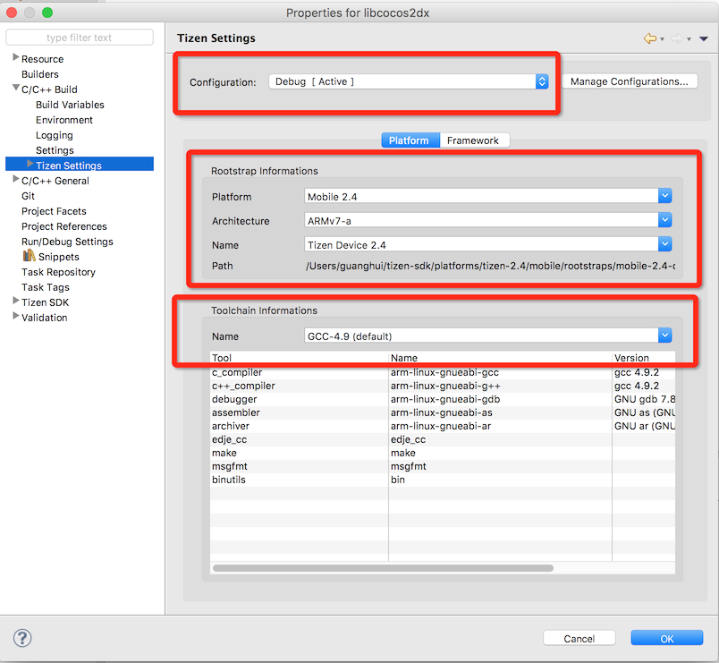

引擎自带工程的 Tizen 设置主要为三个：

- Debug: 这个是默认选项。我们可以在上图中看到 __Configuration__中显示的是 __Debug [ Active ]__ 这个是给真机调试用的。
- Release: 这个选项是给真机编译 release 版本使用的。
- Emulator: 这个选项是给模拟器用。

这里我们需要选择的是 Emulator，首先我们关闭刚才的对话框，然后右键再次选择 __libcocos2dx -> Build Configuration -> Set Active -> Emulator__

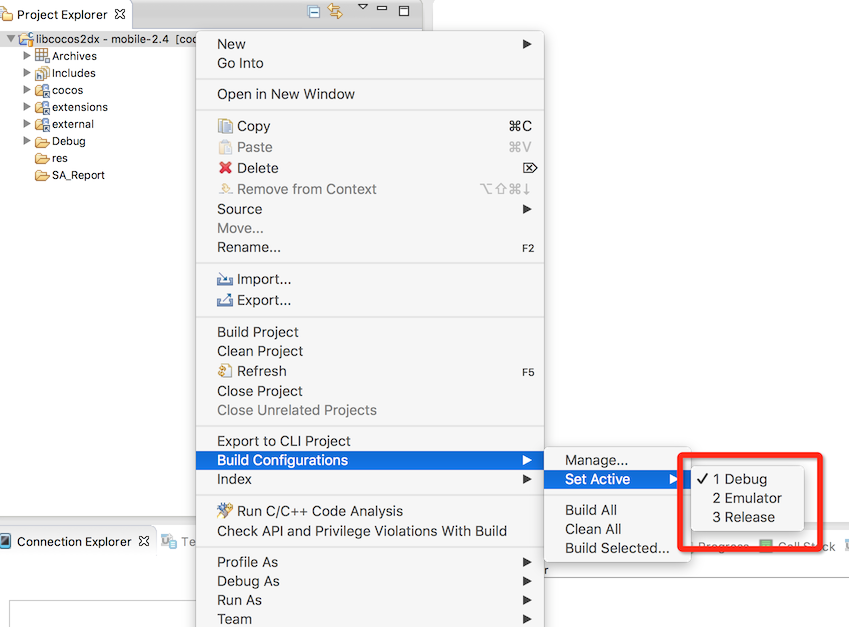

此时我们再选择 __libcocos2dx -> Properties -> C/C++ Build -> Tizen Settings__:

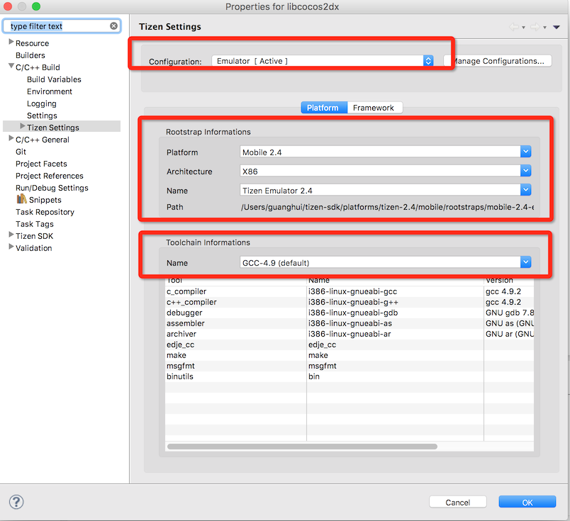

- 开始构建库工程
右键点击 __libcocos2dx -> Properties -> Build Project__:

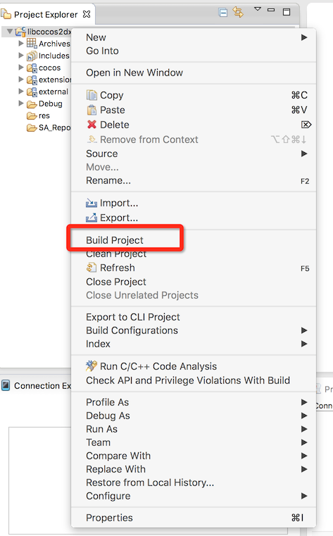

点击 __Build Project__ 之后就会开始构建库工程了，此时 IDE 会调用 Ninjia 来构建整个引擎的库工程：

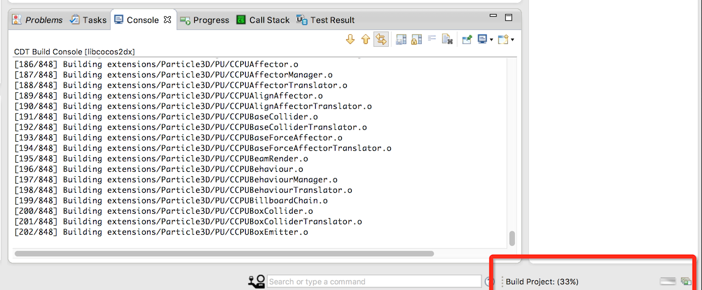

构建完成之后的结果如下图所示：

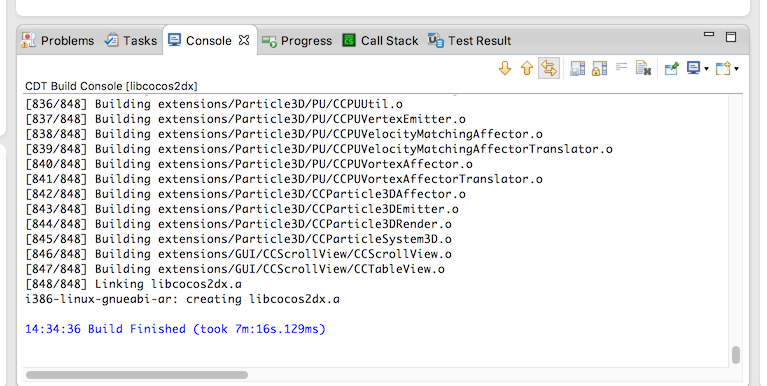

### 导入 Cpp-tests 工程并编译
这里与导入 libcocos2dx 工程的方法类似，在 Browse 已经存在的工程的时候，选择的路径是__$Cocos2dHome/tests/cpp-tests/proj.tizen__

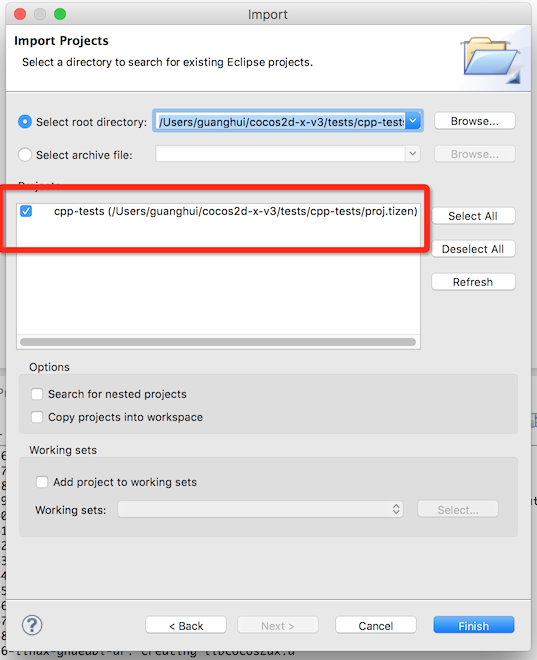

此时，我们需要修改 __Active Build Configuration__ 为 __Emulator__:

修改完这个设置以后，我们再点击 __libcocos2dx --> Properties --> C/C++ Build -> Tizen Settings__ 来验证一下是否正确：

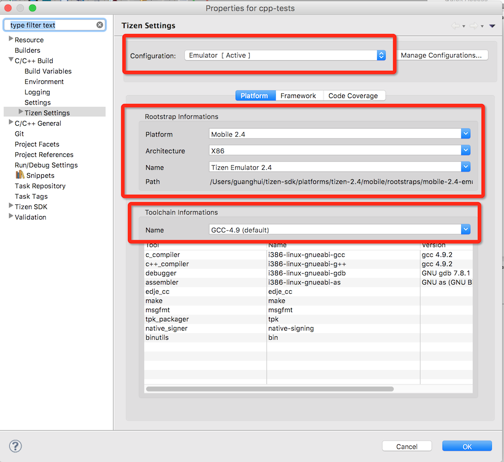

如果你的设置和上图一致，则表明设置成功，可以继续下一步了。

右键点击 __libcocos2dx --> Build Project__ 开始编译 Cpp-tests 工程：

编译成功后的截图：

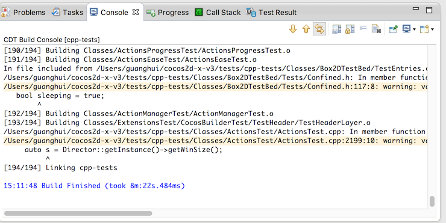

### 运行 Cpp-tests 工程
- 新建模拟器
点击 Tizen IDE 上面的 Emulator Manager 图标：

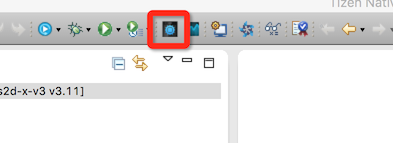

Emulator Manager 运行之后的截图如下：

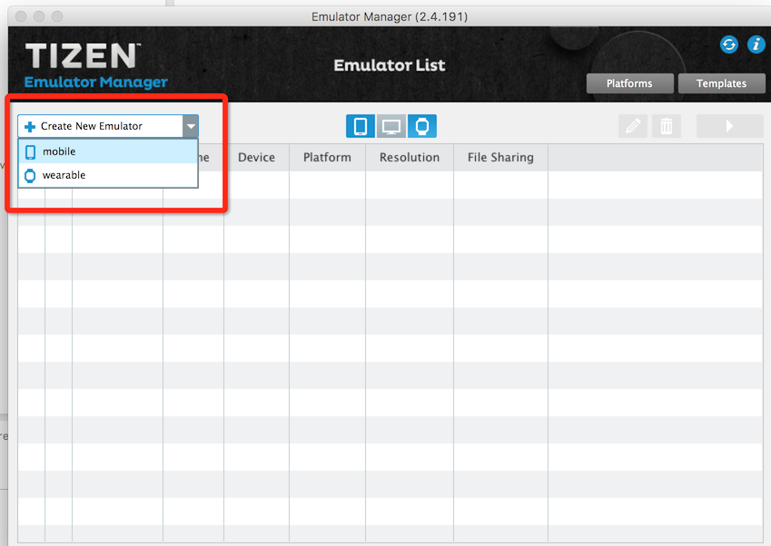

选择 mobile  来创建一个 Tizen 手机的模拟器：

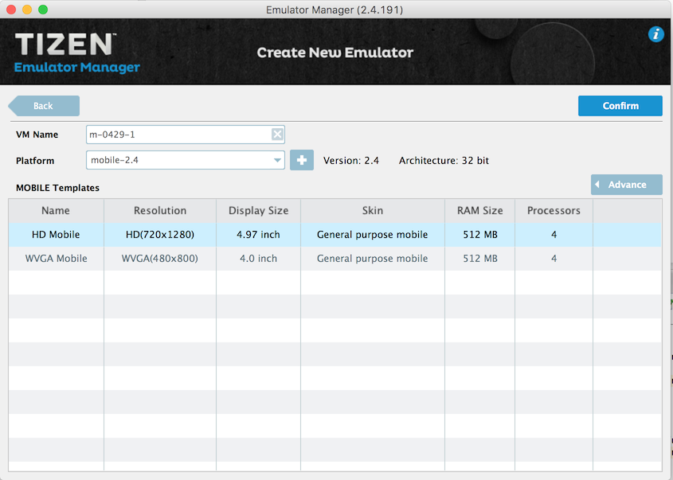

点击 Confirm 之后就成功创建出一个模拟器了：

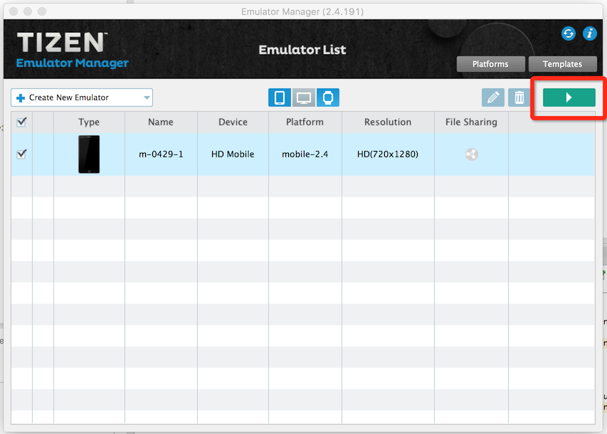

点击上图中的绿色三角形按钮开始运行模拟器：

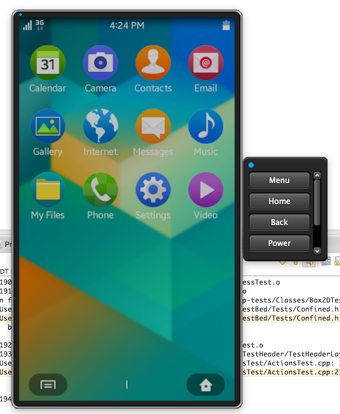

此时我们的 Tizen 模拟器就跑起来啦。

- 运行 Cpp-tests 到模拟器
右键点击工程名字，选择 __Run As --> Tizen Native Application__:

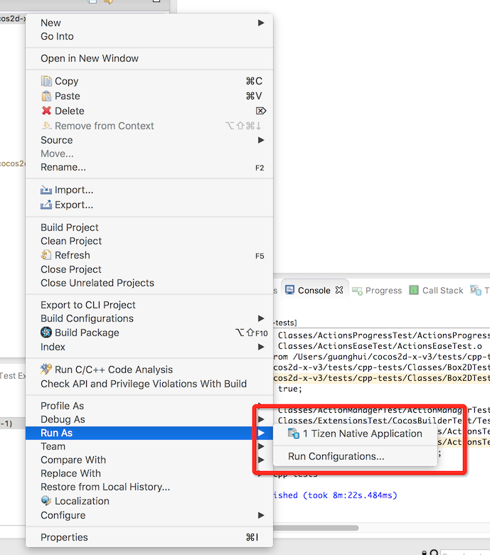

过一段时候，就会把生成的 TPK 安装到模拟器上面了。

下面是两张 Cpp-tests 运行起来以后的截图：

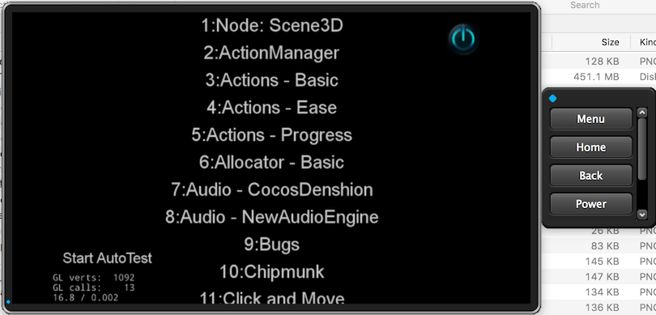

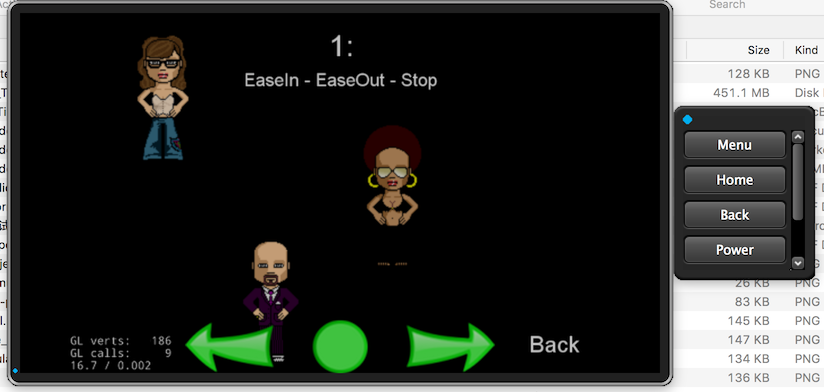

### 额外说明
- 如果要运行 lua 相关的测试例，还需要导入 __$Cocos2dHome/cocos/scripting/lua-bindings/proj.tizen__ 目录下面的 Tizen 工程并编译。

- 如果要把 Cpp-tets 运行到 Tizen 真机上面，在选择库工程和项目工程的编译选项的时候，要选择 Arm 和 Tizen Device。

## 新建 Cocos Tizen 项目并运行
### 创建工程
运行 `cocos new -l cpp YourProjectName` 和 `cocos new -l lua YourProjectName` 来创建相应的 cpp 工程和 lua 工程。

### 导入引擎库工程和项目工程
创建好工程以后，把工程目录下面的 `proj.tizen` 工程导入 Tizen IDE，同时把工程下面的 `cocos2d`目录下面的引擎库工程和脚本工程导入 Tizen IDE。
导入完成以后，根据需求，选择 Active Configuration 为 Emulator 或者 Debug/Release，这几个配置的区别前面的文档已经提到了。

### 编译并运行
确保项目和引擎库工程的编译设置是正确之后，右键点击工程名字，选择 `Build Project` 开始构建。

构建完成之后运行即可。

## 可能遇到的问题

- 编译引擎库工程的时候报错：use of undeclared identifier `PATH_MAX`.

> 你需要使用 GCC 4.9 来编译，而不是 LLVM-GCC 4.9

- `cocos new` 命令创建出来的项目不带 `proj.tizen` 目录

> 出现这个问题的原因可能是你使用的 cocos 命令的版本不正确。
> 你需要运行 `python setup.py` 和  `source ~/.bash_profile` 保证你的 `cocos` 命令指向的是正确的目录
