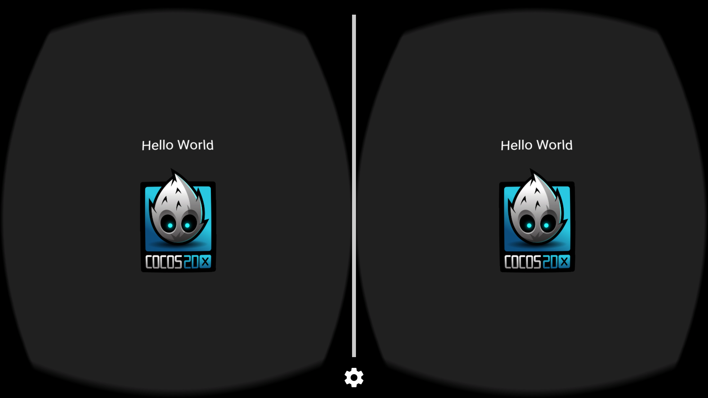
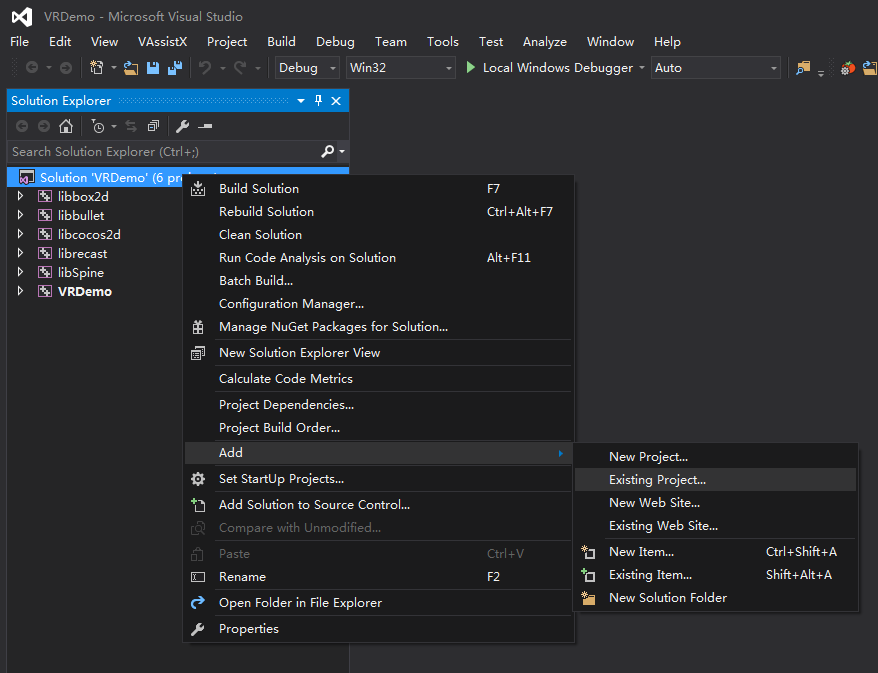
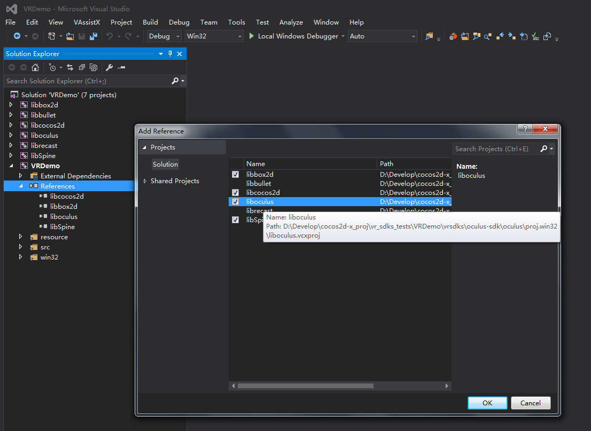
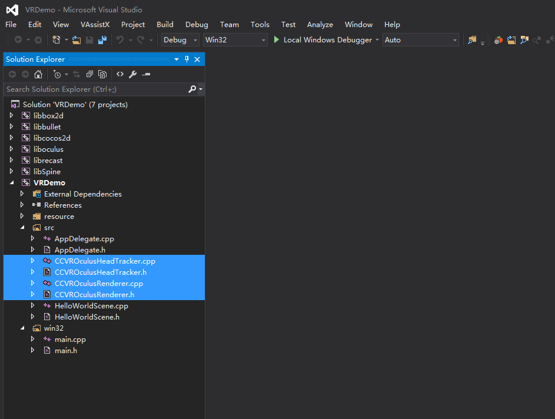
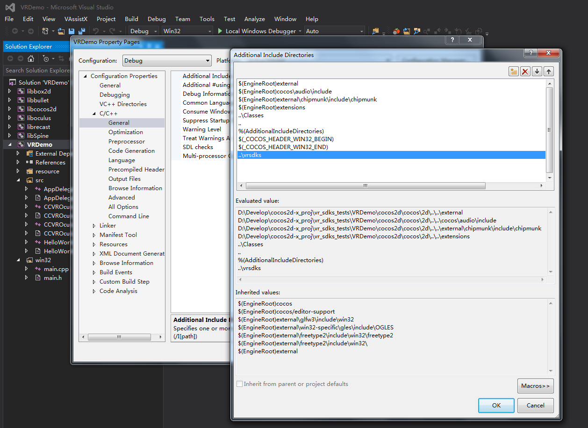

#VR插件的集成与使用
##介绍
cocos2d-x从3.12版本开始支持原生的VR渲染，从3.13版本开始支持第三方VR平台，目前支持的VR平台的情况如下表所示：

| SDK           |  Company       | Runtime Platform |
|---------------|----------------|------------------|
| GearVR        | Samsung        | Galaxy Note 5/S6/S6 Edge/S6 Edge+ |
| GVR(Cardboard And Daydream)           | Google         | Android 4.4 (KitKat) or higher  |
| DeepoonVR      | Deepoon        | Galaxy Note 5/S6/S6 Edge/S6 Edge+ |
| OculusVR       | Oculus         | Oculus Rift(Windows 7+) |

##安装与运行
由于SDK数量众多，cocos2d-x采用package manager的方式来管理所有的SDK，如果想了解package manager的更多信息，请参看**cocos package manager(CPM)**的使用文档。本文仅就如何使用**CPM**安装VR-SDK进行说明。

###安装
1. 打开终端，使用`cocos new`命令新建一个空cocos工程，例如新建一个名为VRDemo的Cpp工程(Lua和Js通用)，如下所示:
	
		$ cocos new VRDemo -l cpp
	
2. 进入VRDemo的根目录下，使用`cocos package import`命令安装所需的VR-SDK（比如项目只需要支持GearVR平台，那么只需安装 `gearvr`，如果需要支持其他VR平台，安装对应SDK即可）:

		$ cocos package import -v -b SDK_NAME --anysdk
	**注意(重要)**：**SDK_NAME**为`vrsdkbase``gearvr` `deepoon` `gvr` `oculus`其中之一。**vrsdkbase**包含了VR运行的参数配置基本信息和cocos默认的VR模式。
	
###运行
1. 由于不同的VR平台需要对工程进行不同程度的修改和配置，并且为了支持把cocos工程同时部署到多个VR平台上，需要使用`switchVRPlatform.py`脚本在已安装的VR平台间进行切换(如果使用cocos内置的VR模式，则不需要使用该脚本，安装完**vrsdkbase**后已经自动开启)。**PLATFORM_NAME**为已安装的VR平台的名称，可使用`switchVRPlatform.py -h`命令查看：
	* Cpp工程：
		
			$ python vrsdks/switchVRPlatform.py -p PLATFORM_NAME
	* Lua和Js工程：
	
			$ python frameworks/runtime-src/vrsdks/switchVRPlatform.py -p PLATFORM_NAME
	**举例**：如果我们想部署到GearVR平台上，首先**安装**`geavr`包，然后使用`switchVRPlatform.py`脚本切换到GearVR平台，之后再进行编译即可。如果同时安装了多个VR平台，每次编译到对应平台前都需要使用该脚本进行切换。
2. 编译测试工程：

* **（部署GearVR/DeepoonVR/GVR）**切换到对应VR平台之后，使用`cocos run`运行工程，并使用表中所列的**Runtime Platform**机器进行测试：

		$ cocos run -p android --app-abi armeabi-v7a
	或者
	
		$ cocos run -p android --android-studio --app-abi armeabi-v7a	
		
	例如运行GVR的效果如下所示：
	
		
		
	**注意**：目前的第三方VR-SDK只能运行在**armeabi-v7a**	架构下，所以编译时一定要带上`--app-abi armeabi-v7a`。
	如果GearVR或者DeepoonVR运行时出现崩溃的情况，请检查`assets`文件夹下是否包含了[oculus signature file](https://developer.oculus.com/documentation/mobilesdk/latest/concepts/mobile-submission-sig-file/)。
	
* **（部署OculusVR）**因为Oculus是面向桌面PC平台，配置方式和移动端的不一样，目前支持的Oculus是Windows平台版本，cocos使用Visual Studio进行编译(以下以VS2015为例说明)，所以需要特别说明:
	
	* 首先把oculus的第三方库**liboculus.vcxproj**导入工程中(在已安装的`oculus-sdk/oculus/proj.win32/`文件夹下)，并添加项目依赖：
	
			

			
	
	* 然后导入`CCVROculusRenderer`和`CCVROculusHeadTracker`两个类(在已安装的`oculus-sdk/`文件夹下)：

		

	* 最后添加VR-SDK的搜索路径`..\vrsdks`，完成后直接进行编译运行即可：

		

	**注意**：如果运行崩溃，请检查是否正确安装了[Oculus Rift Runtime](https://developer.oculus.com/)