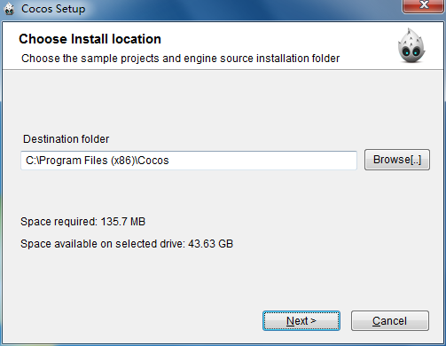
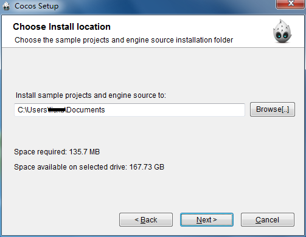
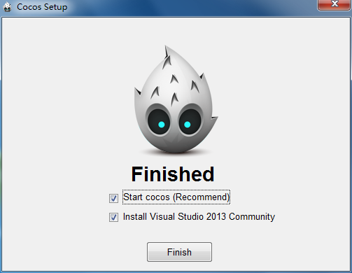
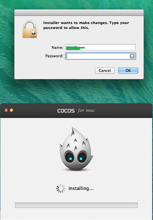

#  Download and Install cocos

### Download ###
 
English Users: [http://www.cocos2d-x.org/download](http://www.cocos2d-x.org/download)

Chinese Users: [http://www.cocos.com/download/](http://www.cocos.com/download/) 

### Install ###

**Windows**

1 Click Browse to select a folder to install cocos, then click **Next**:

  
2 Click Browse to select a folder to save cocos Samples and Addins, then click **Next**: 

3 Installation complete, click **Finish** to run cocos:

**Mac**

1 Open the installation file, then click **Install**: 

2 Enter user name and user password: 

3 Installation complete, click **Finish** to run cocos: 

