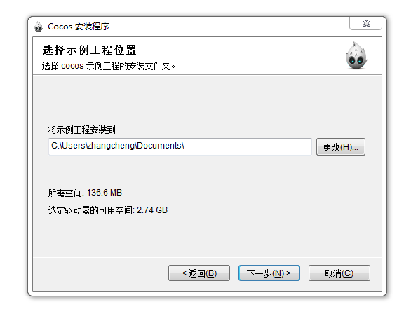
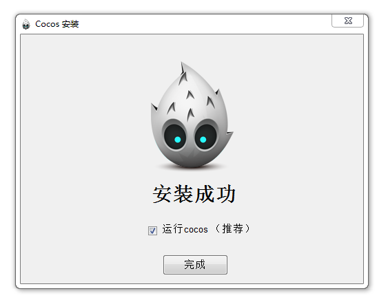
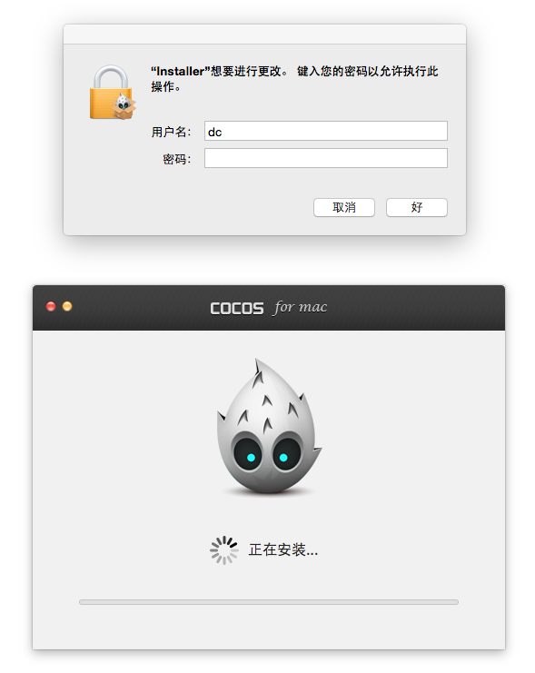

# 下载和安装

下载地址：
 
&emsp;&emsp;  Cocos产品中文下载链接：http://www.cocos.com/download

&emsp;&emsp;  Cocos产品英文下载链接：http://www.cocos2d-x.org/download

安装说明：

&emsp;&emsp; **Windows**：

  &emsp;&emsp;    1、选择cocos安装目录，然后下一步：

  
 &emsp;&emsp; 2、选择cocos示例工程以及插件的安装目录后，然后下一步：

&emsp;&emsp; 3、安装完成：

&emsp;&emsp; **Mac：**

&emsp;&emsp;  1、打开安装界面，然后点击立即安装：

&emsp;&emsp;  2、安装过程中，请输入输入用户密码：

&emsp;&emsp;  3、安装完成：

