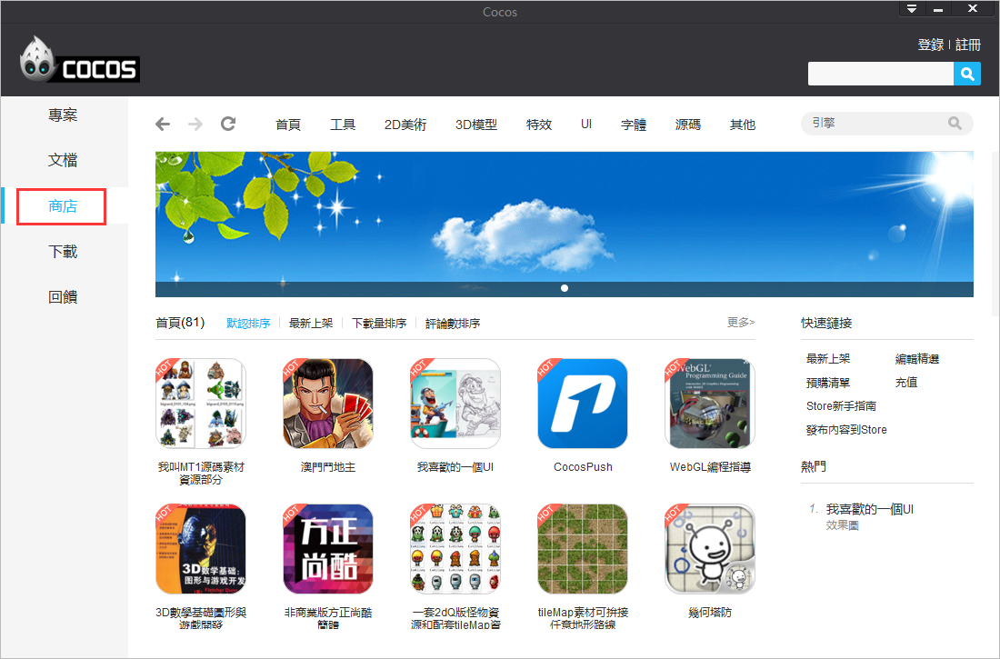
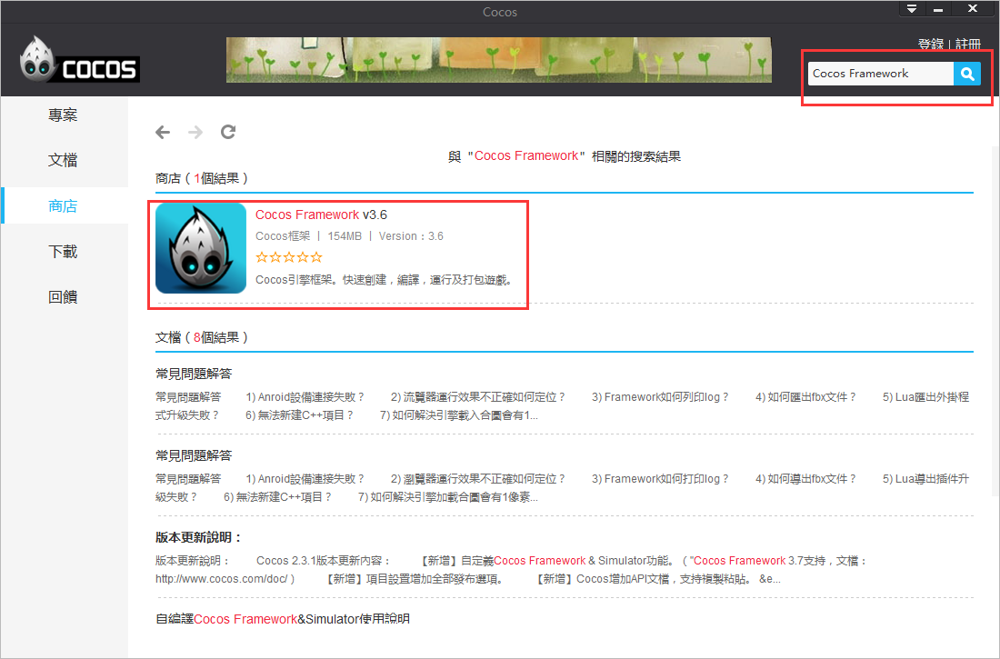
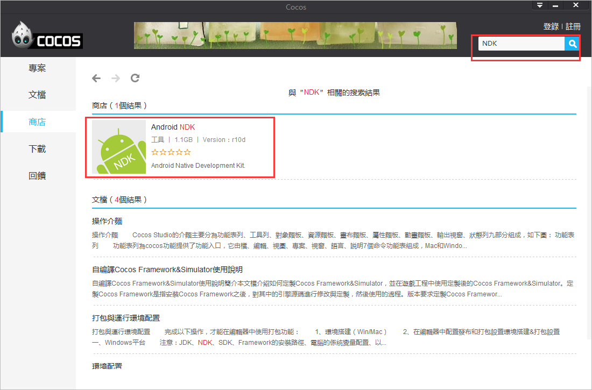
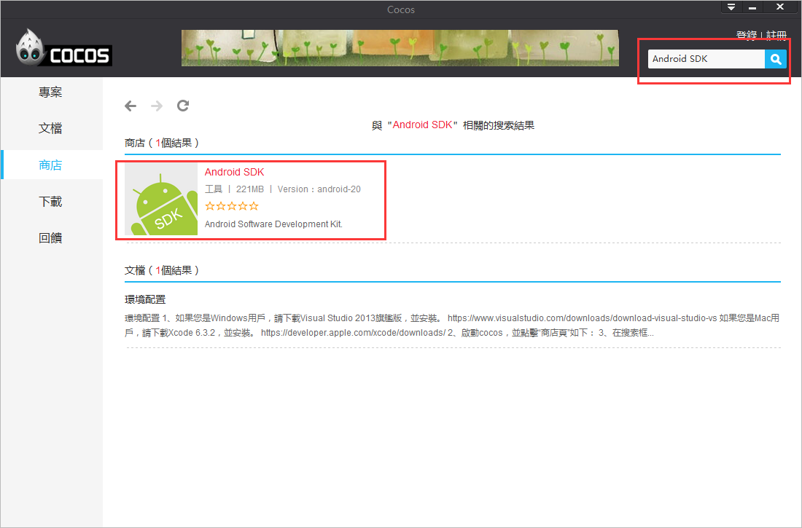
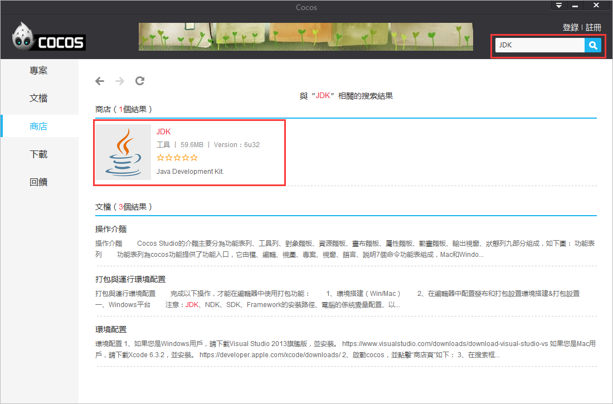
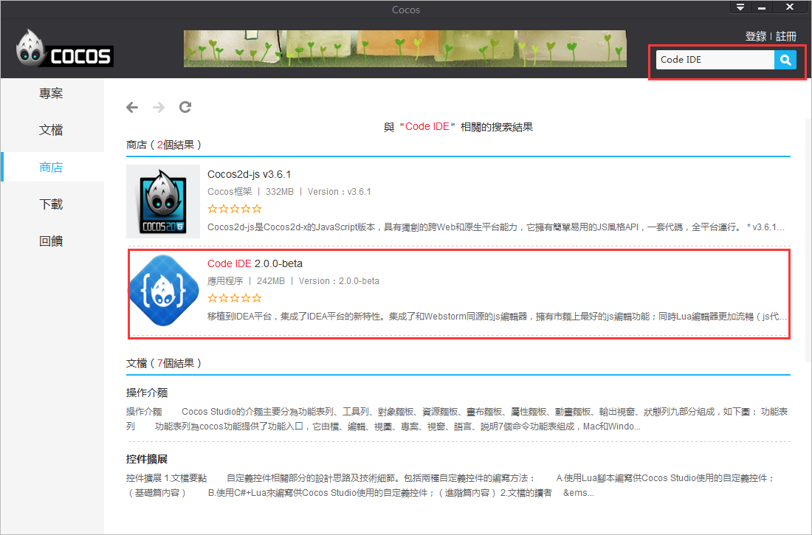

#環境配置

1、如果您是Windows用戶，請下載**Visual Studio 2013旗艦版**，並安裝。

[https://www.visualstudio.com/downloads/download-visual-studio-vs](https://www.visualstudio.com/downloads/download-visual-studio-vs)

如果您是Mac用戶，請下載**Xcode 6.3.2**，並安裝。

[https://developer.apple.com/xcode/downloads/](https://developer.apple.com/xcode/downloads/)

2、啟動cocos，並點擊“商店頁”如下： 

3、在搜索框輸入“Cocos Framework”，回車，下載並安裝，如下圖：

4、在搜索框輸入“NDK”，回車，下載並解壓，如下圖：

5、在搜索框輸入“Android SDK”，回車，下載並解壓，如下圖：

 6、在搜索框輸入“JDK”，回車，下載並安裝，如下圖：

7、在搜索框輸入“Code IDE”，回車，下載並安裝，如下圖：

