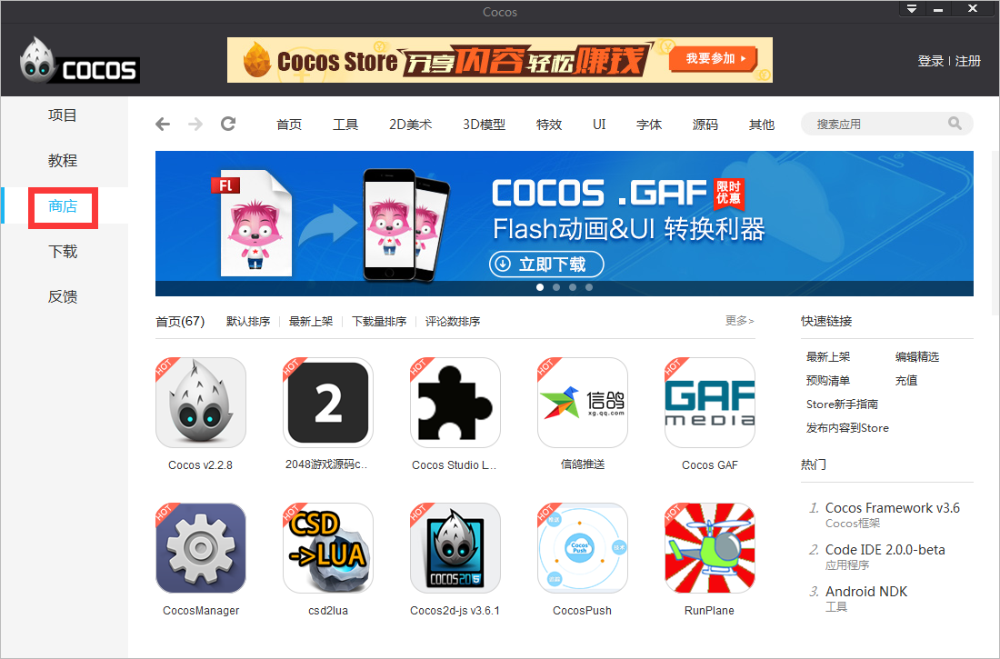
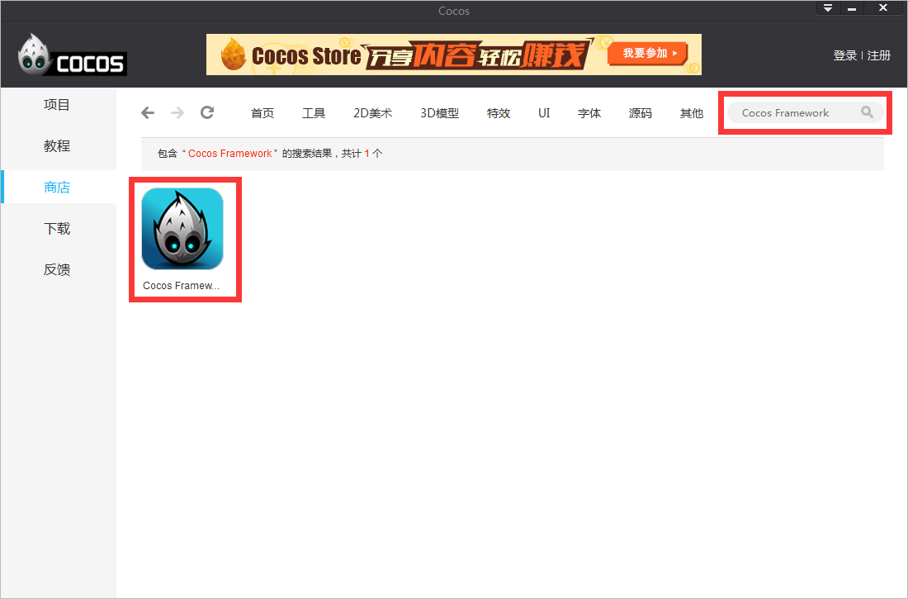
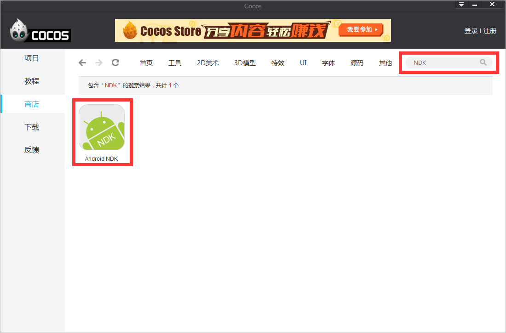
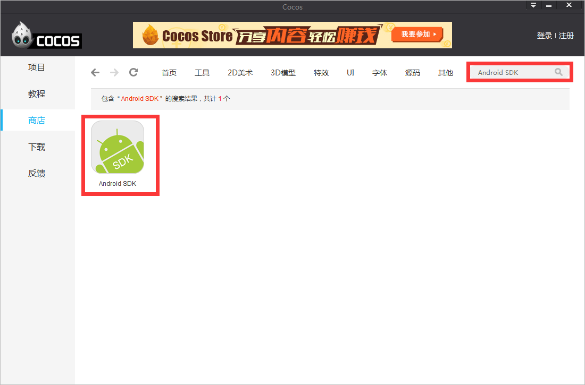
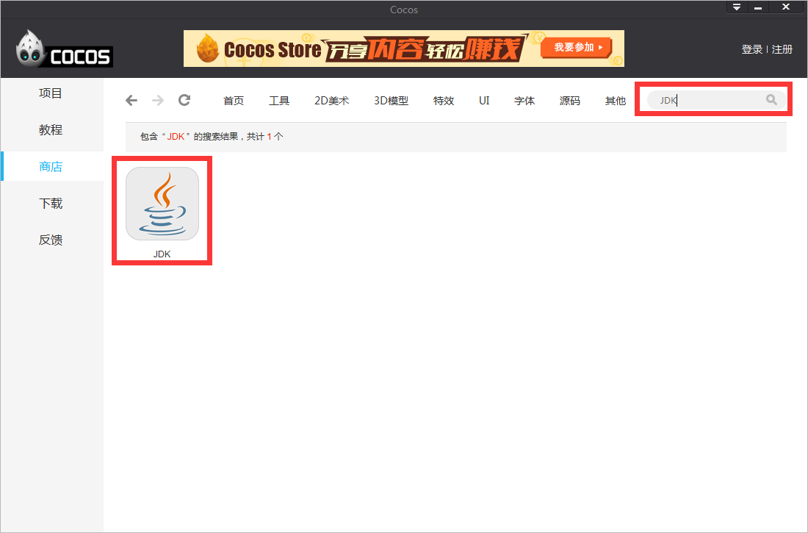
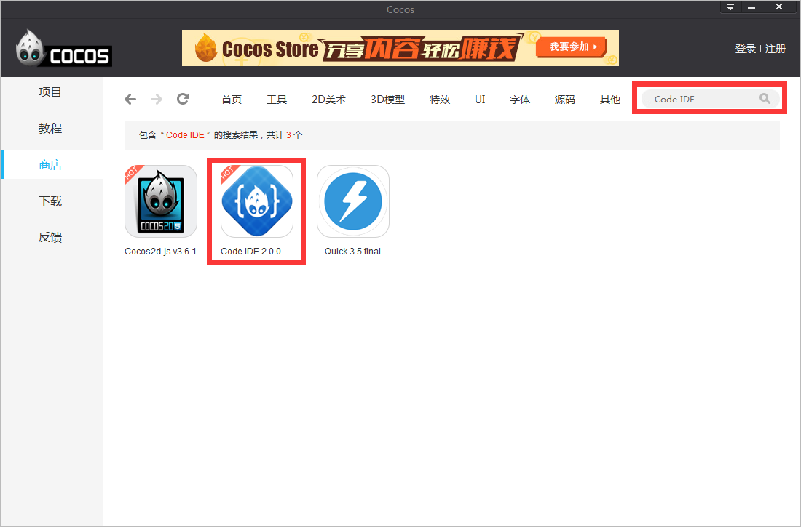

# 环境配置

1、如果您是Windows用户，请下载**Visual Studio 2013旗舰版**，并安装。

[https://www.visualstudio.com/downloads/download-visual-studio-vs](https://www.visualstudio.com/downloads/download-visual-studio-vs)

  如果您是Mac用户，请下载**Xcode 6.3.2**，并安装。

[https://developer.apple.com/xcode/downloads/](https://developer.apple.com/xcode/downloads/)

2、启动cocos，并点击“商店页”如下： 

3、在搜索框输入“Cocos Framework”，回车，下载并安装，如下图：

4、在搜索框输入“NDK”，回车，下载并解压，如下图：

5、在搜索框输入“Android SDK”，回车，下载并解压，如下图：

 6、在搜索框输入“JDK”，回车，下载并安装，如下图：

7、在搜索框输入“Code IDE”，回车，下载并安装，如下图：

