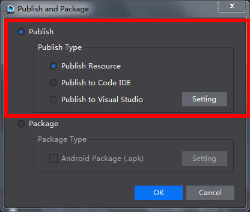

#Coding and Debugging

### Coding ###

Cocos Studio supports publishing and loading project files in **Visual Studio** and **Xcode**. Do the following,  

Select **Project** -> **Publish and Package**, as following picture shows, 

&emsp;&emsp;&emsp;&emsp;&emsp;&emsp;           

***Note** Lua and JS projects can be opened in Visual Studio, XCode and Code IDE. C++ projects can be opened in Visual Studio and Xcode.*  

### Debugging ###

- See [Visual Studio](https://msdn.microsoft.com/en-us/aa290595(zh-cn,vs.71)). 
         
    
