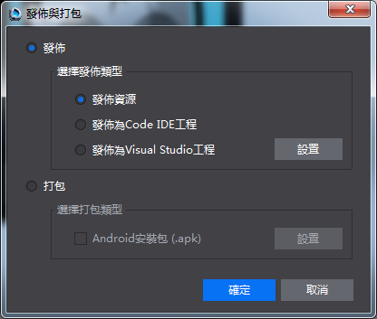

#編碼與調試

&emsp;&emsp;從Cocos Studio“發佈與打包”介面可以分別打開，Code IDE，Visual Studio，以及Xcode，如下圖：

&emsp;&emsp;&emsp;&emsp;&emsp;&emsp;&emsp;&emsp;           

&emsp;&emsp;Cocos的C++項目無法使用Code IDE打開，lua和js項目既可以使用Visual Studio和Xcode打開，又可以通過Code IDE打開。

&emsp;&emsp;Visual Studio 調試幫助(https://msdn.microsoft.com/zh-cn/library/aa290595%28v=vs.71%29.aspx)

&emsp;&emsp;Code IDE調試幫助(http://www.cocos.com/doc/article/index?type=code-ide&url=/doc/cocos-docs-master/manual/code-ide/function-guides/debugging/debug-principle-for-lua/tw.md) 。
         
    
