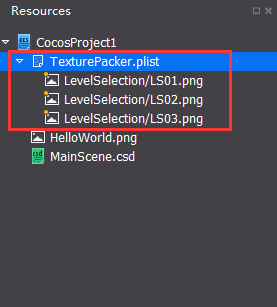
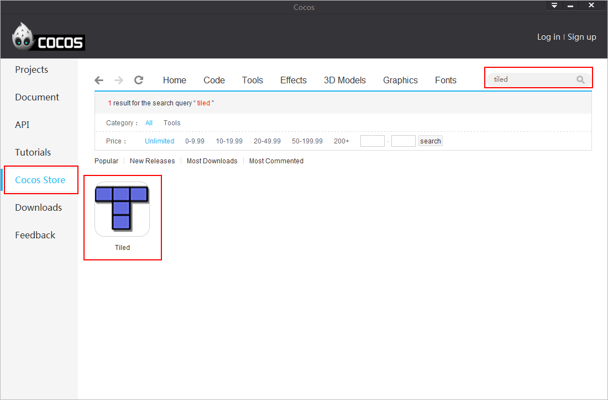
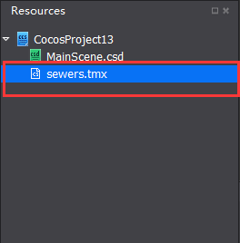
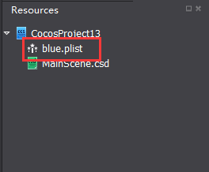
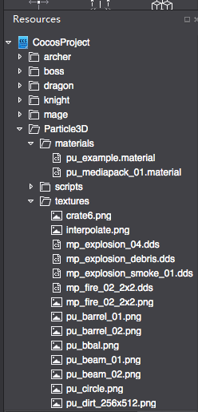

#External Editors

The external editors supported by Cocos2d-x are supported by cocos as well. Export resources from external editors, import these resources to cocos Resource Panel, then you can edit the resources as you need with various widgets. Now we would like to introduce you how to use external editors. 

### Texture Packer ###

- Download Texture Packer at Cocos Store. 

- Export Tilde files from Texture Packer, named as sewers.tmx & sewers.png

- Right-click `TexturePacker.plist` or `TexturePacker.png` on Resource Panel, select "Import Resources", browse and select TexturePacker.plist. The following picture shows a successful import: 

&emsp;&emsp;
 
- Resource panel will automatically expand all png images in current plist files. You can drag and drop files within the sprite sheet to customize widgets' properties. When published, the image is a .plist file.  

### Tiled ###

- Download Tiled at Cocos Store.

 
- Export TileMap files from Tiled. 

- Right-click` sewers.tmx` on the Resource Panel, select "Import Resources", browse and select `sewers.tmx`. The following picture shows a successful import:

&emsp;&emsp;

- Add a TileMap to Rendering panel, then you can customize its settings. 

### Particle Designer（only for Mac）

- Download Particle Designer at Cocos Store. 

- Export particle files (.plist) from Particle Designer.

- Right-click `blue.plist` on Resource Panel, select "Import Resources", browse and select `blue.plist`. The following picture shows a successful import:

&emsp;&emsp;

###Particle Universe

Cocos Studio supports Particle Universe (a free particle editor based on OGRE), which can be used to create vivid 3D particle special effects. 

- Create particles' special effects with Particle Universe. PU files, materials, textures and scripts are stored in materials/texture/script folders respectively. 

&emsp;&emsp;

- Import the resources created in previous step to Cocos Studio, without changing the folder structure of particle  files.

&emsp;&emsp;
 
- Drag and drop particle universe files from Script folder to canvas (scene). 
