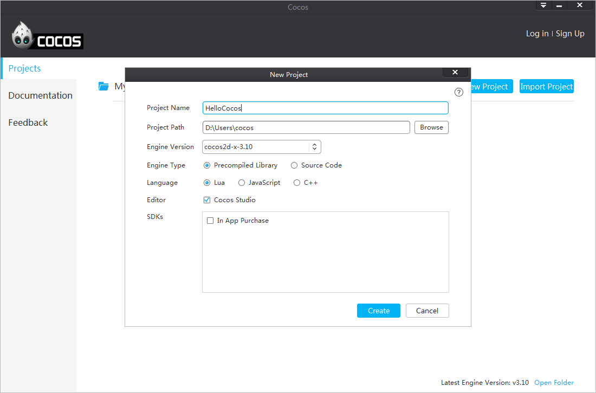
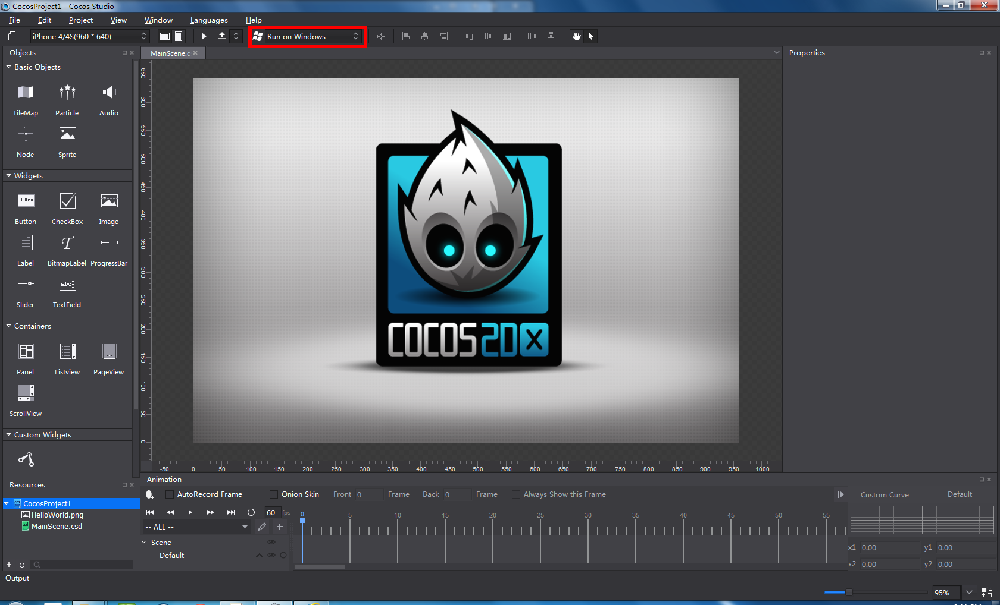
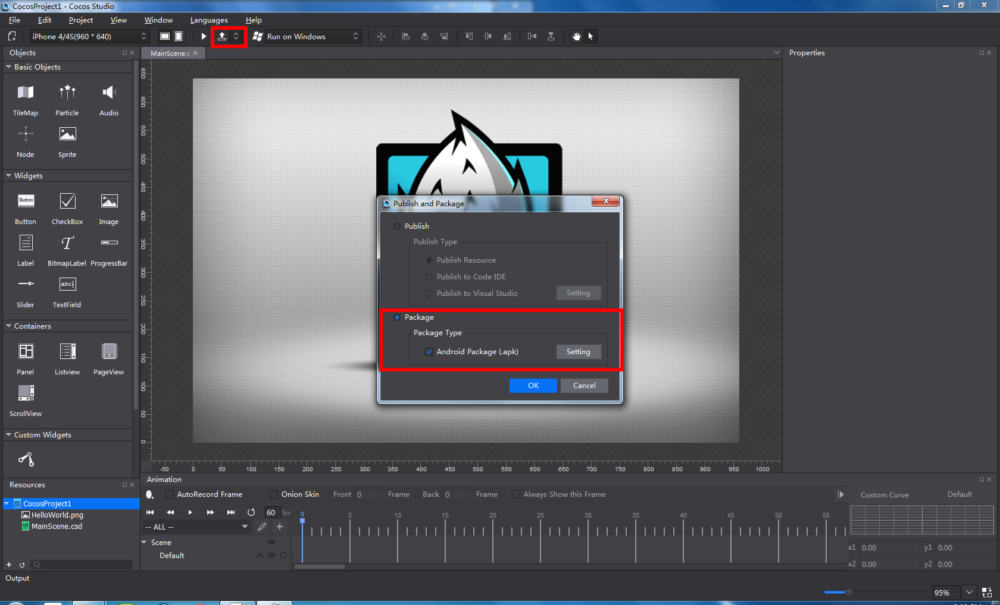
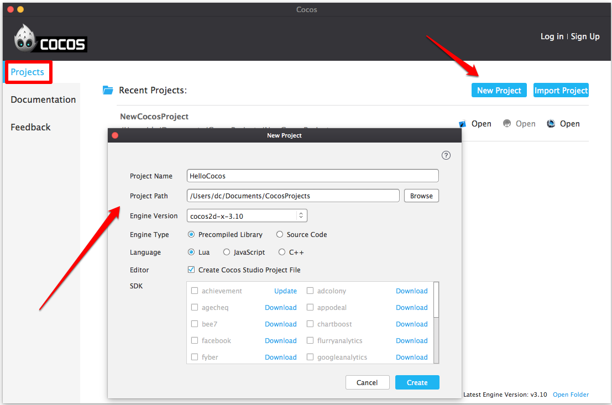
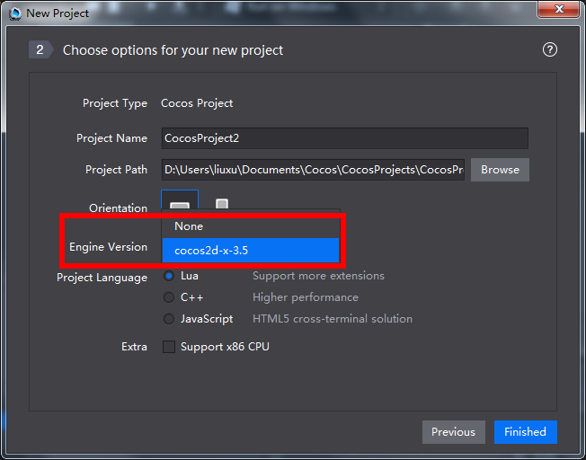
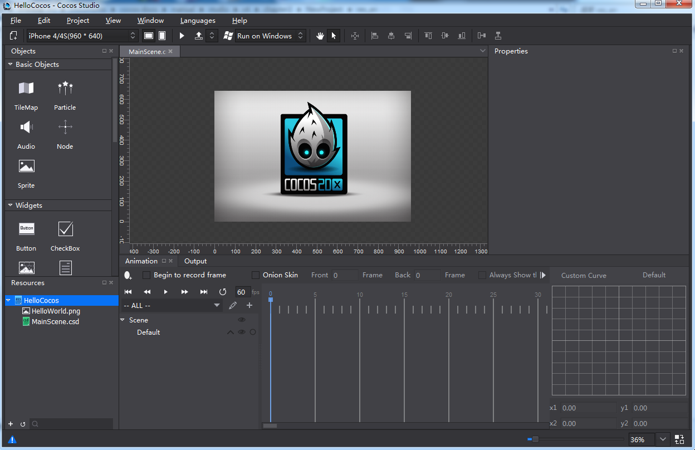

# Create a Game #

### Project Overview ###

Cocos is an all-in-one solution for all your needs in developing games, covering functions of editing resources, coding, running on real devices and packaging. In the following section, we will introduce you how to build a perfect game with cocos. 

**New Project** The  first step is to create a game project. Cocos provides sample projects that you can use as resources or learn from. 

**Edit** With cocos, you can create and edit UI, 2D/ 3D scenes, Keyframe Animations, SpriteSheet Animations and Skeletal Animations. Cocos supports files exported from the following software, which can be downloaded at [Cocos Store](http://store.cocos.com/).  

- *.plist* file exported from **TexturePacker**;
- animation files exported from **Flash**;
- Particle files exported from **Particle Designer** and **Particle Universe**; 
- 3D models and animations from **3DMax**, etc. 

**Code** Cocos supports editing and debugging Lua, JavaScript and C++ with Visual Studio, XCode and Cocos Code IDE. Cocos Code IDE is a complete toolkit for developing, debugging, publishing Lua & JavaScript games. 

**Run on real devices** You can run projects on real devices, for example mobile phones (Android, iOS), PC (Windows, Mac), and browsers.

**Package** Cocos can be widely used to build mobile games and apps on platforms of Android, iOS and HTML5.

### Project Settings###
 
Projects settings include Project Name, Project Path, Orientation, Engine Version and Project Language, etc. 

- **Project Name**: the name of a game project. 

- **Project Path**: the location of a game project. 

- **Orientation**: a game's orientation, horizontal or vertical. 

- **Engine Version**: Cocos Framework is not necessary for JavaScript and Lua projects, but necessary for C++ projects.  You can download Cocos Framework in Cocos Store. We can see from the above picture that Cocos Framework 3.5 has been installed, otherwise **None** will be displayed in the Engine Version drop-down list. 

- **Supported scripting languages**

     - Lua: based on Cocos 2d-x Lua binding. It can run on Windows, Mac, Android, iOS. 

    - C++: based on Cocos 2d-x. It can run on Windows, Mac, Android and iOS. Cocos Framework is necessary for a new C++ project. 

    - JavaScript: based on Cocos 2d-jx. It includes Cocos 2d-x JS binding and Cocos 2d HTML5. Interface of JS binding is compatible with that of HTML5. Game codes can run in Cocos2d-x and HTML5 native engine. When packaging projects to Win32, Mac, iOS and Android, the default setting is JS binding. When packaging projects to HTML5, the default setting is Cocos 2d-x. 

- **Extra**: If you want to create a game that can run on x86-based Android devices, select **Support x86 CPU**. 

   Click **Finished**. A cocos project is successfully created. 

