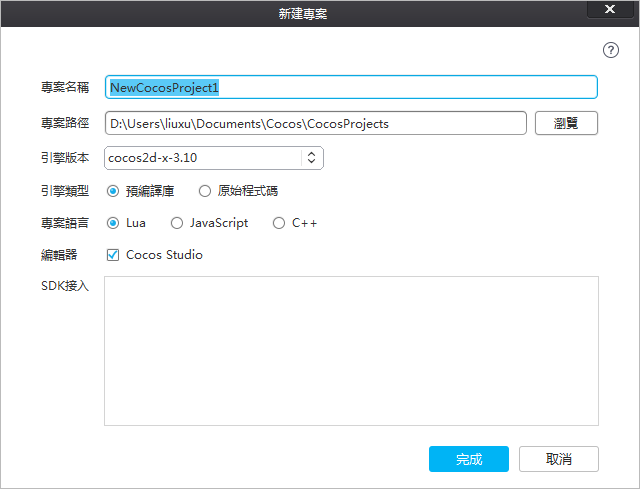
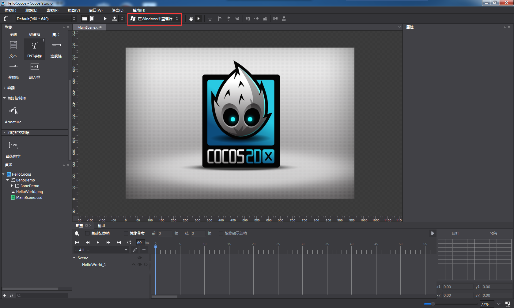
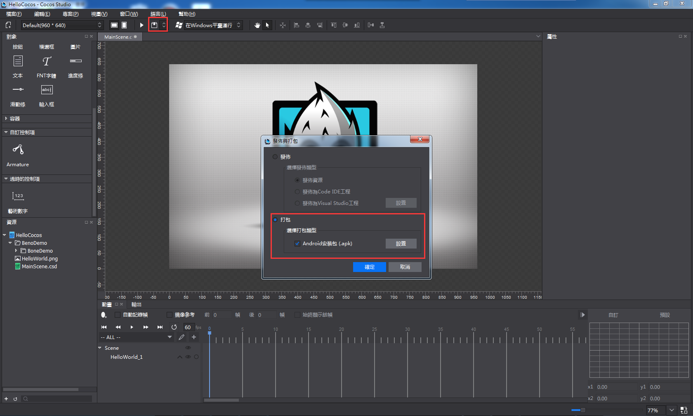
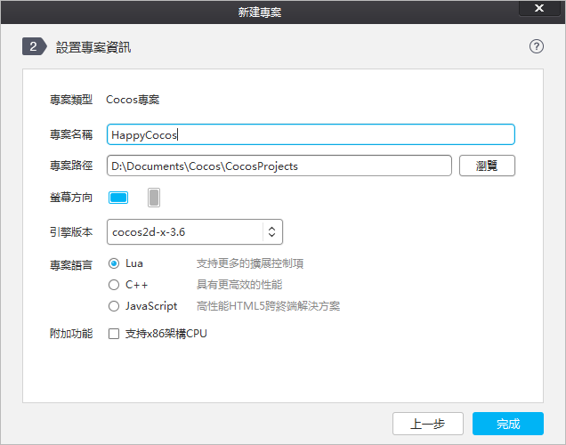
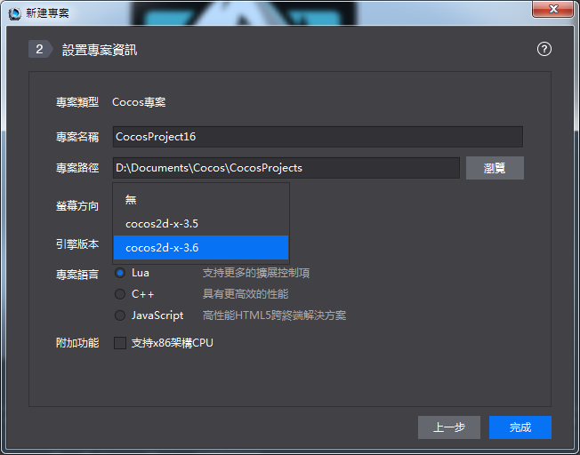
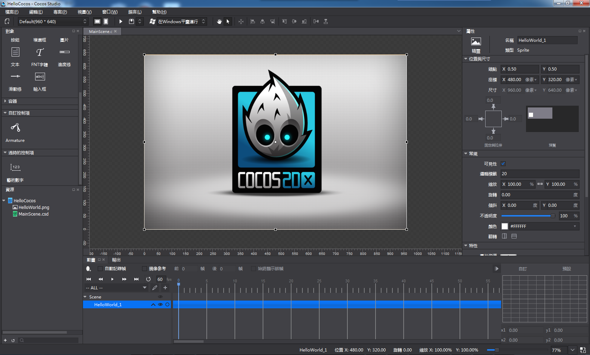

#創建新遊戲
###一、認識cocos專案：

&emsp;&emsp;Cocos項目整合了資源編輯、代碼編寫調試，真機運行以及遊戲打包的功能：

&emsp;&emsp;資源編輯：通過cocos可以直接進行2D/3D場景、遊戲介面（UI）、關鍵幀動畫、序列幀動畫，骨骼動畫的編輯，同時支援國內外最優秀工具產出的資料，比如：支援TexturePacker產出的plist合圖資料，支援Particle Designer以及Particle Universe產出的粒子資料，支援3DMax產出的3D模型/動畫資料等等，這些優秀的工具不用再去google搜索下載，我們已經把它們添加到cocos啟動頁“商店”裡面，大家可以直接到商店裡面免費下載使用，如下圖：

&emsp;&emsp;代碼編輯：Cocos專案支援lua、js、C++三種語言，支援Visual Studio、Xcode、Cocos Code IDE遊戲代碼編寫與調試，Visual Studio、Xcode分別是Windows和Mac系統上最強的代碼IDE，Cocos Code IDE是由觸控開發的專門針對於lua、js兩種語言的代碼編寫與調試工具，大家可以根據擅長的技術選擇使用。

&emsp;&emsp;真機運行：在遊戲開發過程中，Cocos支援運行專案在Android、iOS手機上，Windows和Mac作業系統以及流覽器上， 如下圖：

&emsp;&emsp;遊戲打包：當遊戲開發完畢之後，可以通過才cocos生成遊戲App，支持Android、iOS、HTML5 App的生成，如下圖：
 

###二、新建cocos項目：
 
&emsp;&emsp;Cocos新建專案可以設置專案的名稱、專案路徑、螢幕方向、引擎的版本、專案語言以及附加功能。

&emsp;&emsp;項目名稱：遊戲項目名稱。

&emsp;&emsp;專案路徑：遊戲專案所在的路徑。

&emsp;&emsp;螢幕方向：表示所製作的遊戲是橫屏還是豎屏。

&emsp;&emsp;引擎版本：在沒有安裝Cocos Framework（整合Cocos 2d-x以及Cocos 2d-js引擎原始程式碼，並基於整合後的原始程式碼進行編譯，編譯出來的二進位庫就是Cocos Framework，Cocos Framework同時支持luabinding、jsbinding、js、C++，商店裡面可以下載）無法新建C++項目的，只可以新建js和lua的專案，C++專案需要安裝Cocos Framework，當安裝了Cocos Framework後，可以在引擎版本選擇安裝的Cocos Framework進行新建。如下圖：

代表已經安裝了Cocos Framework 3.5，否則是“無”。

 
&emsp;&emsp;專案語言：

&emsp;&emsp;&emsp;&emsp;Lua：指令碼語言，基於Cocos 2d-x luabinding（將Cocos 2d-x介面綁定到lua層並加入Quick Lua框架），可以運行在Windows、Mac、Android、iOS。

&emsp;&emsp;&emsp;&emsp;C++：編譯型語言，基於Cocos 2d-x引擎，可以運行在Windows、Mac、Android、iOS， 新建C++專案需要安裝Cocos Framework。

&emsp;&emsp;&emsp;&emsp;JavaScript：指令碼語言，基於Cocos 2d-js引擎，Cocos 2d-js引擎包含Cocos 2d-x jsbinding（將Cocos 2d-x的介面綁定到JS層）和Cocos 2d-html5（純JS 引擎），jsbinding和Html5介面相容，同一套JS遊戲邏輯代碼既可以驅動Cocos 2d-x也可以驅動Html5原生引擎，當打包到Win32、Mac、iOS、Android平臺的時候默認基於jsbinding，打包到HTML5基於Cocos 2d-js引擎。
附加功能：只針對于Android，開啟“支持x86架構cpu”後，編譯出來的Android程式可以運行在使用x86架構的cpu的手機上。

###三、點擊完成。

&emsp;&emsp;根據參數選擇好自己想要的，點擊完成，Cocos項目被創建出來了，如下圖：

