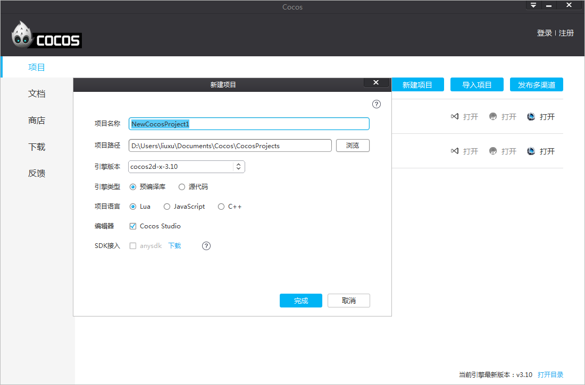
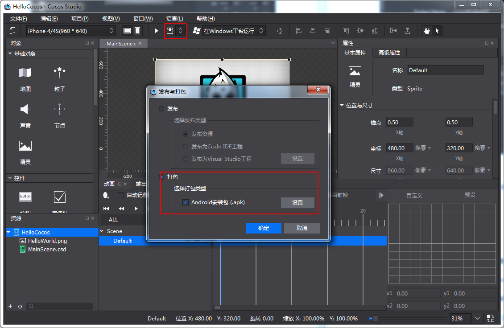
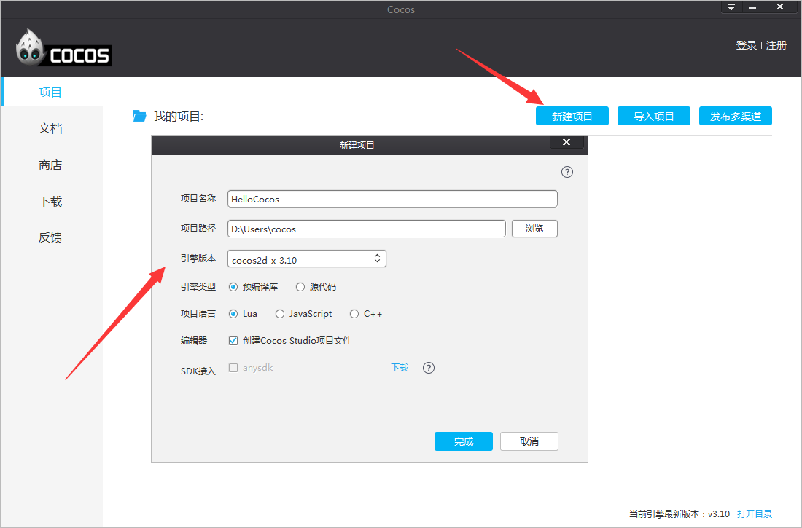
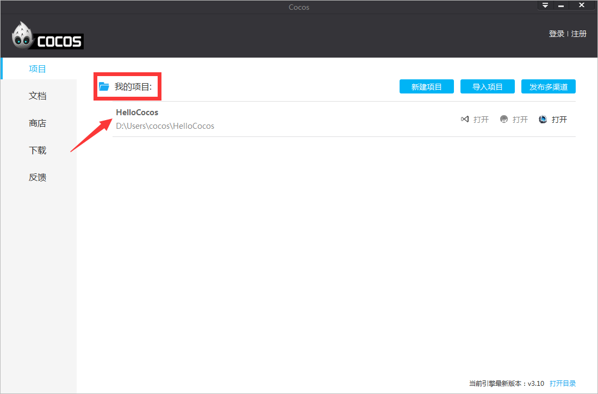
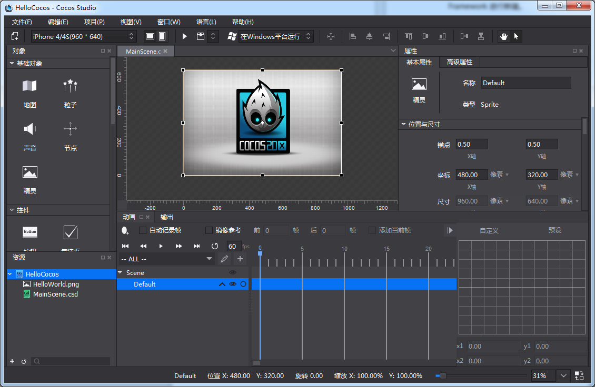

# 创建新游戏
###一 认识cocos项目：

&emsp;&emsp;Cocos项目整合了资源编辑、代码编写调试，真机运行以及游戏打包的功能：

&emsp;&emsp;资源编辑：通过cocos可以直接进行2D/3D场景、游戏界面（UI）、关键帧动画、序列帧动画，骨骼动画的编辑，同时支持国内外最优秀工具产出的数据，比如：支持TexturePacker产出的plist合图数据，支持Particle Designer以及Particle Universe产出的粒子数据，支持3DMax产出的3D模型/动画数据等等，这些优秀的工具不用再去google搜索下载，我们已经把它们添加到cocos启动页“商店”里面，大家可以直接到商店里面免费下载使用，如下图：

&emsp;&emsp;代码编辑：Cocos项目支持lua，js，C++三种语言，支持Visual Studio，Xcode，Cocos Code IDE游戏代码编写与调试，Visual Studio，Xcode分别是Windows和Mac系统上最强的代码IDE，Cocos Code IDE是由触控开发的专门针对于lua，js两种语言的代码编写与调试工具，大家可以根据擅长的技术选择使用。

&emsp;&emsp;真机运行：在游戏开发过程中，Cocos支持运行项目在Android，iOS手机上，Windows和Mac操作系统以及浏览器上， 如下图：

&emsp;&emsp;游戏打包：当游戏开发完毕之后，可以通过才cocos生成游戏App，支持Android，iOS，HTML5 App的生成，如下图：
 

###二、新建cocos项目：
 
&emsp;&emsp;Cocos新建项目可以设置项目的名称，项目路径，屏幕方向，引擎的版本，项目语言以及附加功能。

&emsp;&emsp;项目名称：游戏项目名称。

&emsp;&emsp;项目路径：游戏项目所在的路径。

&emsp;&emsp;屏幕方向：表示所制作的游戏是横屏还是竖屏。

&emsp;&emsp;引擎版本：在没有安装Cocos Framework（整合Cocos 2d-x以及Cocos 2d-js引擎源代码，并基于整合后的源代码进行编译，编译出来的二进制库就是Cocos Framework，Cocos Framework同时支持luabinding，jsbinding，js，C++，商店里面可以下载）无法新建C++项目的，只可以新建js和lua的项目，C++项目需要安装Cocos Framework，当安装了Cocos Framework后，可以在引擎版本选择安装的Cocos Framework进行新建。如下图：

代表已经安装了Cocos Framework 3.5，否则是“无”。

 
&emsp;&emsp;项目语言：

&emsp;&emsp;&emsp;&emsp;Lua：脚本语言，基于Cocos 2d-x luabinding（将Cocos 2d-x接口绑定到lua层并加入Quick Lua框架），可以运行在Windows，Mac，Android，iOS。

&emsp;&emsp;&emsp;&emsp;C++： 编译型语言，基于Cocos 2d-x引擎，可以运行在Windows、Mac、Android、iOS， 新建C++项目需要安装Cocos Framework。

&emsp;&emsp;&emsp;&emsp;JavaScript：脚本语言，基于Cocos 2d-js引擎，Cocos 2d-js引擎包含Cocos 2d-x jsbinding（将Cocos 2d-x的接口绑定到JS层）和Cocos 2d-html5（纯JS 引擎），jsbinding和Html5接口兼容，同一套JS游戏逻辑代码既可以驱动Cocos 2d-x也可以驱动Html5原生引擎，当打包到Win32，Mac，iOS，Android平台的时候默认基于jsbinding，打包到HTML5基于Cocos 2d-js引擎。
附加功能： 只针对于Android，开启“支持x86架构cpu”后，编译出来的Android程序可以运行在使用x86架构的cpu的手机上。

###三、点击完成。

&emsp;&emsp;根据参数选择好自己想要的，点击完成，Cocos项目被创建出来了，如下图：

