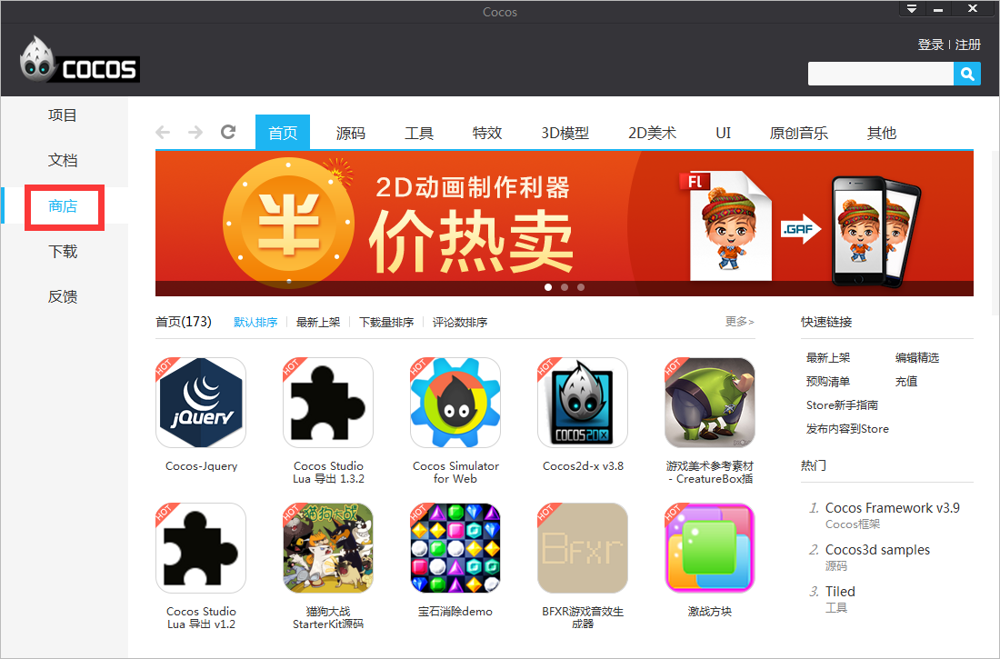

#创建新游戏
###一、认识cocos项目，如图1：

&emsp;&emsp;&emsp;&emsp;&emsp;&emsp;&emsp;&emsp;&emsp;&emsp;&emsp;&emsp;&emsp;&emsp;&emsp;&emsp;&emsp;&emsp;**图1.新建项目**

&emsp;&emsp;Cocos项目整合了资源编辑、代码编写调试，真机运行以及游戏打包的功能：

&emsp;&emsp;资源编辑：通过cocos可以直接进行2D/3D场景、游戏界面（UI）、关键帧动画、序列帧动画，骨骼动画的编辑，同时支持国内外最优秀工具产出的数据，比如：支持TexturePacker产出的plist合图数据，支持Particle Designer以及Particle Universe产出的粒子数据，支持3DMax产出的3D模型/动画数据等等，这些优秀的工具不用再去google搜索下载，我们已经把它们添加到cocos启动页“商店”里面，大家可以直接到商店里面免费下载使用，如图2：

&emsp;&emsp;&emsp;&emsp;&emsp;&emsp;&emsp;&emsp;&emsp;&emsp;&emsp;&emsp;&emsp;&emsp;&emsp;&emsp;&emsp;&emsp;**图2. Cocos商店**

&emsp;&emsp;代码编辑：Cocos项目支持lua、js、C++三种语言，支持Visual Studio、Xcode游戏代码编写与调试，Visual Studio、Xcode分别是Windows和Mac系统上最强的代码IDE。

&emsp;&emsp;真机运行：在游戏开发过程中，Cocos支持运行项目在Android、iOS手机上，Windows和Mac操作系统以及浏览器上， 如图3：

&emsp;&emsp;&emsp;&emsp;&emsp;&emsp;&emsp;&emsp;&emsp;&emsp;&emsp;&emsp;&emsp;&emsp;&emsp;&emsp;&emsp;&emsp;**图3. 运行到各平台**

&emsp;&emsp;游戏打包：当游戏开发完毕之后，可以通过才cocos生成游戏App，支持Android、iOS、HTML5 App的生成，如下图：
 

&emsp;&emsp;&emsp;&emsp;&emsp;&emsp;&emsp;&emsp;&emsp;&emsp;&emsp;&emsp;&emsp;&emsp;&emsp;&emsp;&emsp;&emsp;**图4. 生成游戏App**

###二、新建cocos项目：
 
打开启动器，在面板右上角的位置，您可以看到“新建项目”的按钮，点击此按钮，在弹出的“新建项目”对话框中，按照提示填写项目名称、项目项目路径、引擎版本、引擎类型、项目语言、编辑器、SDK接入，然后点击“完成”即可创建一个新项目。如图5：

&emsp;&emsp;&emsp;&emsp;&emsp;&emsp;&emsp;&emsp;&emsp;&emsp;&emsp;&emsp;&emsp;&emsp;&emsp;&emsp;&emsp;&emsp;&emsp;&emsp;&emsp;&emsp;&emsp;&emsp;&emsp;&emsp;&emsp;&emsp;&emsp;**图5. 新建项目界面**

&emsp;&emsp;**项目名称**：游戏项目名称。

&emsp;&emsp;**项目路径**：游戏项目所在的路径。

&emsp;&emsp;**引擎版本**：选择基于哪个cocos2d-x的版本创建项目。

&emsp;&emsp;**引擎类型**：
         
&emsp;&emsp;&emsp;&emsp;&emsp;&emsp;预编译库：基于cocos2d-x源代码编译而成的二进制库。

&emsp;&emsp;&emsp;&emsp;&emsp;&emsp;源代码：基于cocos2d-x源代码。

&emsp;&emsp;**项目语言**：

&emsp;&emsp;&emsp;&emsp;&emsp;&emsp;Lua：脚本语言，基于cocos2d-x luabinding（将cocos2d-x接口绑定到lua层并加入Quick Lua框架），可以运行在Android、iOS、Windows Phone、Windows、Mac。

&emsp;&emsp;&emsp;&emsp;&emsp;&emsp;JavaScript：脚本语言，基于cocos2d-js引擎，cocos2d-js引擎包含cocos2d-x JavaScript binding（将cocos2d-x的接口绑定到JavaScript层）和cocos2d-js（纯JavaScript引擎），JavaScript binding和Html5接口兼容，同一套JavaScript游戏逻辑代码既可以驱动cocos2d-x runtime，也可以驱动Html5原生引擎，当打包到Android、iOS、Windows Phone、Windows、Mac平台的时候默认基于JavaScript binding，打包到HTML5基于cocos2d-js引擎。

&emsp;&emsp;&emsp;&emsp;&emsp;&emsp;C++：编译型语言，基于cocos2d-x引擎，可以运行在Android、iOS、Windows Phone、Windows、Mac。

&emsp;&emsp;**编辑器**：是否创建cocos2d-x官方编辑器Cocos Studio项目文件。

&emsp;&emsp;**SDK接入**：是否添加AnySDK服务。

###三、点击完成。
&emsp;&emsp;根据需求选择参数设置，点击“完成”，cocos项目就创建成功了。新创建的cocos项目将被添加到“我的项目”，如图6：

&emsp;&emsp;&emsp;&emsp;&emsp;&emsp;&emsp;&emsp;&emsp;&emsp;&emsp;&emsp;&emsp;&emsp;&emsp;&emsp;&emsp;&emsp;&emsp;&emsp;&emsp;&emsp;&emsp;&emsp;&emsp;&emsp;&emsp;&emsp;&emsp;&emsp;**图6. 我的项目** 

&emsp;&emsp;&emsp;&emsp;&emsp;&emsp;&emsp;&emsp;&emsp;&emsp;&emsp;&emsp;&emsp;&emsp;&emsp;&emsp;&emsp;&emsp;**图7. HelloCocos项目** 
