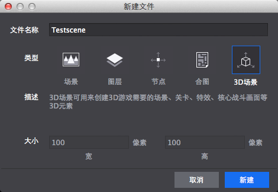

#Create 3D Scenes

**1 Create a New Scene**

Click File ->  New File, select "3D Scene" and  name the file as "Testscene". ：

&emsp;&emsp; 

**2 Import Scene Resources**

The files in the red dashed box are the resources to be used in this scene sample. You can choose other alternaive resources to build a scene following the  steps shown below. 

&emsp;&emsp; 

**3 Arrange Scene Resources** 

- Drag and drop "changing.c3b" from Scene folder to scene. Select it and set its properties as the following picture shows. 

&emsp;&emsp; 
 
- Drag and drop "dragon.c3b" from dragon folder to scene. Select it and set its properties as the following picture shows. 

&emsp;&emsp; 

- Drag and drop "knight.c3b" and "mage.c3b" to scene. Select them and set their properties respectively, and you can see the following scene. 

&emsp;&emsp; 
 
- Create a camera, and set its basic properties as following. 

&emsp;&emsp; 
 
- A draft scene can be viewed with camera as the following picture shows. 

&emsp;&emsp; 
 
- Publish this scene file to cocos project, and a simple game such as Hero VS. Monster can be achieved by adding code control. 