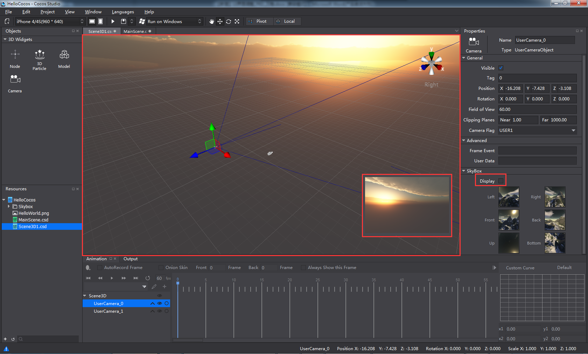

#Skybox

Skybox is a technique used to create a sphere with textures drawn around the scene or the camera. It helps to create an environment infinitely far away, such as a blue sky with white clouds or a dark sky with stars. 

How to create a skybox

1. To enable Skybox. Check the Display option in the Skybox tab under Properties panel. Skybox can be attached to the root node of a 3D scene and cameras. 

2. Assign six pictures (jpg, png) to the skybox, including Left, Right, Front, Back, Up and Bottom. Match the pictures to the direction they represent. 

3. Display of skybox. 

a. If Skybox is enabled only for the root node, skybox will display in rendering section, camera preview window, and simulator.

b. If Skybox is enabled for a camera, skybox will display in camera preview window and simulator.

 
c. If Skybox is enabled for multiple cameras with same Camera Flag, skybox of a higher level camera will display in both camera preview window and simulator. If Skybox is enabled for multiple cameras with different Camera Flag, skybox of the selected camera will display in camera preview window while skybox of a higher level camera will display in simulator. 

*Note: Only when the 6 sides of the skybox are assigned with pictures, can the skybox display. The six pictures should be same in size, filename extension and coding format.*
