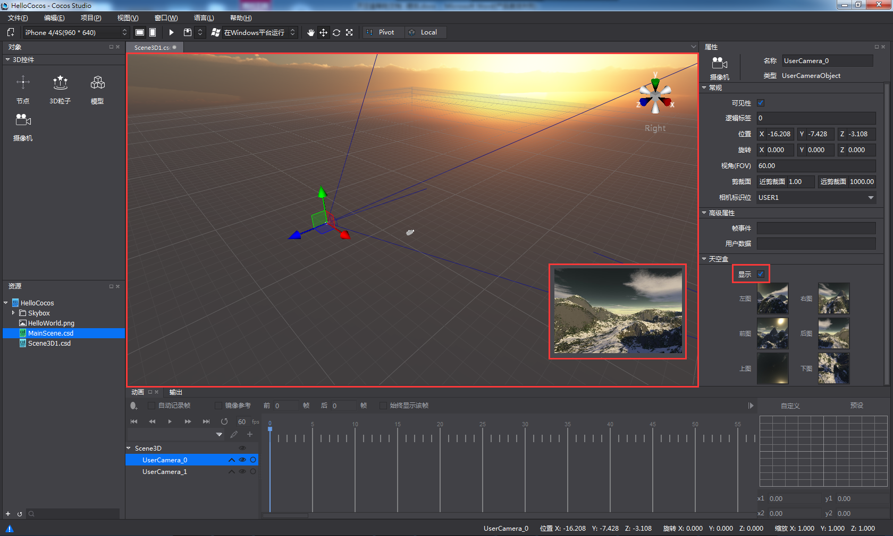

#天空盒

&emsp;&emsp;天空盒是一种特殊的材质，该材质可以笼罩在整个场景之外或者摄像机之外来模拟类似天空之类的效果。如，繁星满天、蓝天白云和月夜等。

天空盒用法

（1）	在属性面板-天空盒：勾选开启天空盒功能（3D场景根节点和摄像机包含天空盒组件）

（2）	将属性区天空盒分页的左图、右图、前图、后图、上图、下图分别添加图片资源（jpg, png）

         
（3）	天空盒的显示

&emsp;&emsp;1.当场景（根节点）勾选开启天空盒属性，摄像机中未勾选时，渲染区、摄像机小窗口、模拟器中均显示场景（根节点）的天空盒；

 
&emsp;&emsp;2.当摄像机勾选开启天空盒属性时，摄像机小窗口、模拟器显示摄像机的天空盒。

 
&emsp;&emsp;3.当渲染区同时添加多个摄像机且开启天空盒属性时，若摄像机的标识位相同，摄像机小窗口、模拟器则显示渲染层级最高（结构树位置靠下）的摄像机的天空盒；若标识位不同，摄像机小窗口显示当前选中的摄像机的天空盒，模拟机仍渲染层级最高（结构树位置靠下）的摄像机的天空盒。

&emsp;&emsp;注意：天空盒的左图、右图、前图、后图、上图、下图的图片资源的大小、图片格式、编码格式必须一致，且六个属性必须全部添加资源才能显示。

