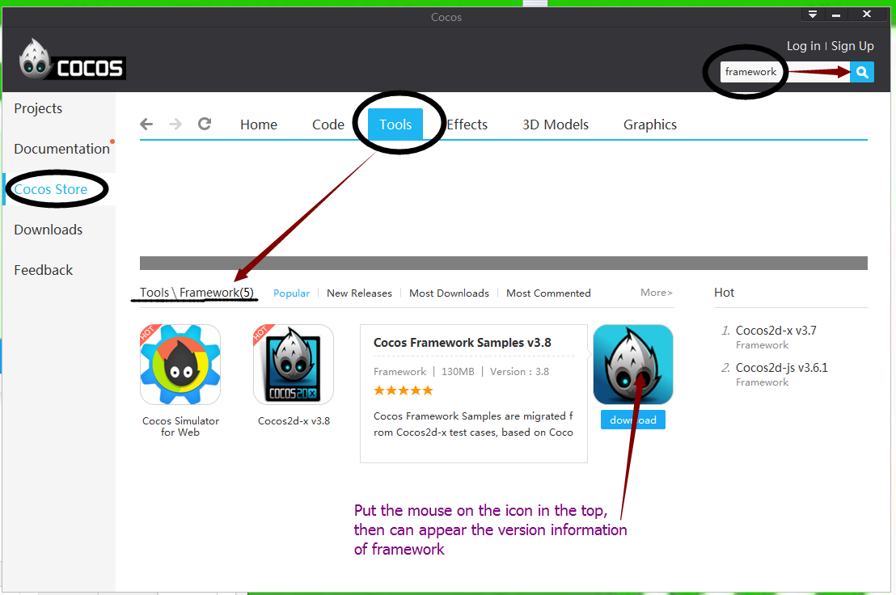
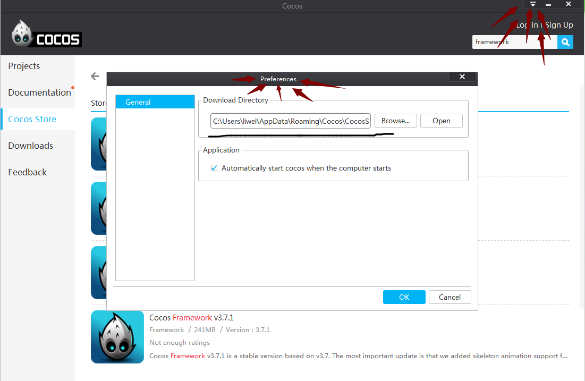
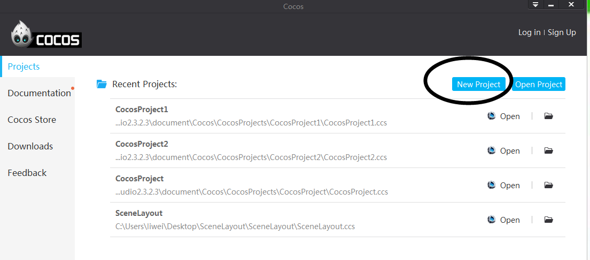
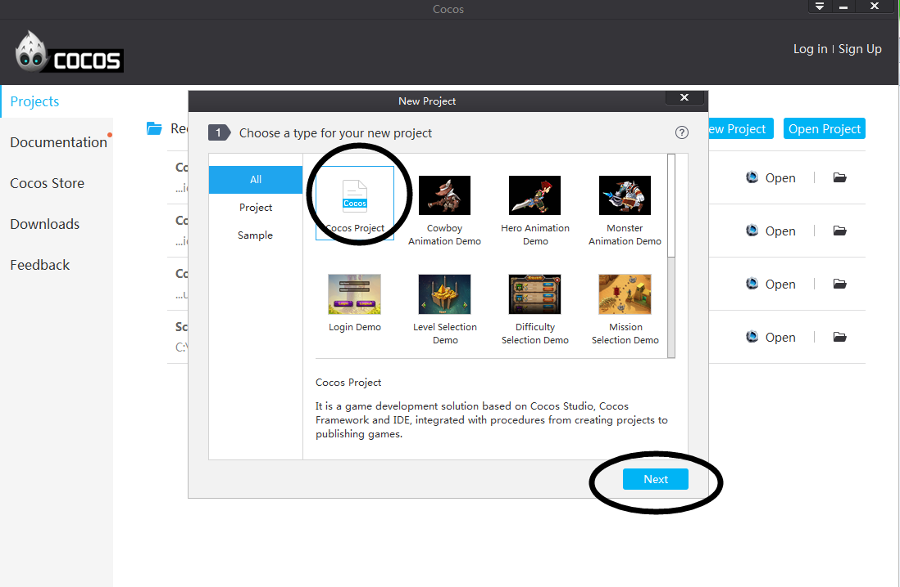
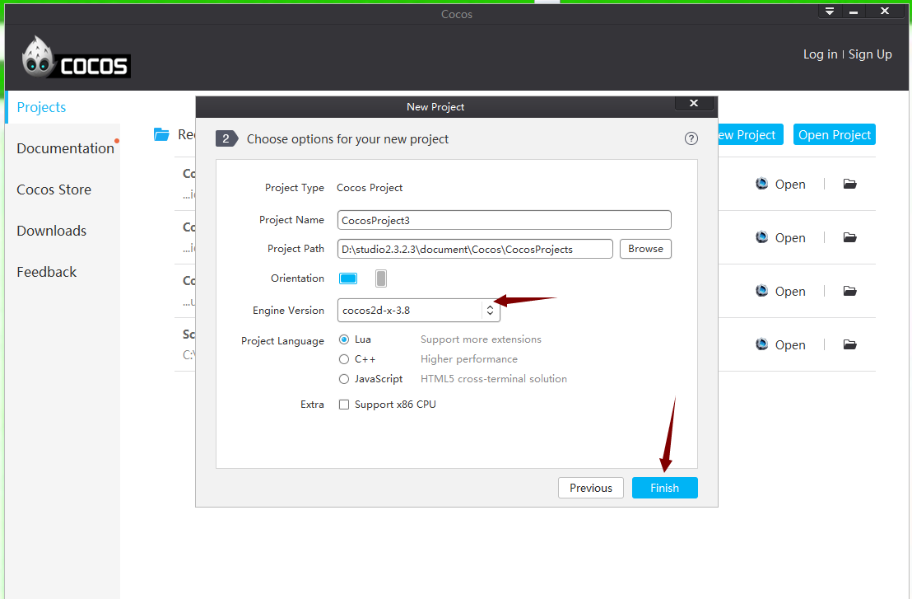
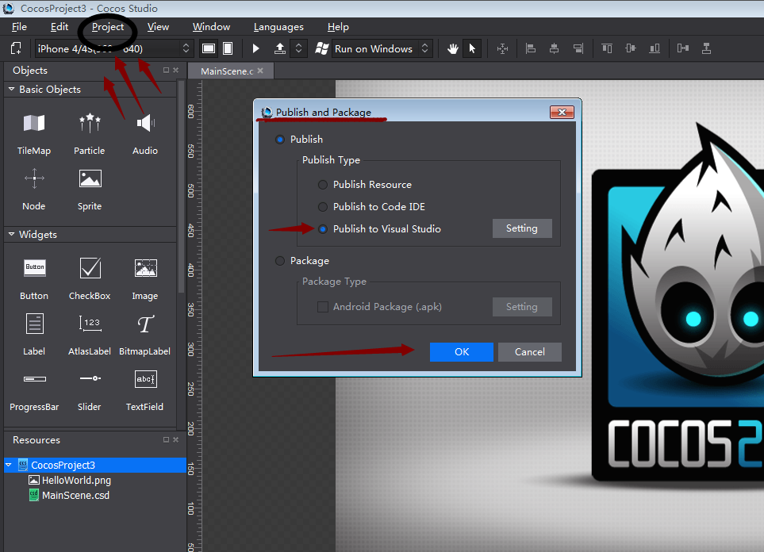

# How to use Cocos Framework？

### Differences between Framework and Cocos 2d-x source code 

Framework is same as Cocos 2d-x in function and API, for it is a precompiled library of Cocos 2d-x. There are also differences. Framework, the precompiled library,  will help you save time in compiling your project, especially to C++ projects. Secondly, developers can edit cocos source codes in Framework v3.7+. 

### 5 Steps to Use Framework

Here is a simple to guide for getting started with Cocos Framework. Follow the steps below: 

&emsp;&emsp;1 Download Cocos Framework at Cocos Store. 

&emsp;&emsp;2 Install Cocos Framework (You can change the default location, but with no spaces or special characters in the installation path). 

&emsp;&emsp;3 Restart cocos (you need to exit the Launcher at the lower right corner of your screen). 

&emsp;&emsp;4 Create a new project, and then select version and language of Cocos Framework. 

&emsp;&emsp;5 Publish projects to VS. 

### Detailed Instructions for Cocos Framework

If the short instructions above do not work out for you, please read the following: 

#### Download Cocos Framework

Download Cocos Framework at Cocos Store. Form v2.3.2.3+, cocos has 2 types of installation packages, with Framework and without Framework. Follow either of the following methods to download the Framework. 
 

- Cocos Store -> Tools -> Framework -> Click Cocos Framework to download. You will get the latest version of Cocos Framework in this way. 

 

- Cocos Store > enter "Framework" in the search box -> click to search. You will see multiple versions of Cocos Framework. 

### Install Framework

2 ways to install Framework. You can choose either of them. 

- Automatic install. Click "Downloads" in Cocos Launcher -> Find the downloaded Framework -> click it to auto-install. 
 
 

- Manual install. As the above picture shows, Cocos Launcher -> Settings (upper right corner of Launcher) -> click "Browse" to open the download directory -> click to install the Framework package. Remember do not contain spaces or special characters in the path if you need to change the default download directory. 

###Create and run projects with Cocos Framework 
 
 

Create a project with Cocos Framework, as the above picture shows. 

***Note**: you need to quit cocos before creating the project.* 

Following the pictures below to create a Cocos Framework project and publish it to VS: 

 

 

 

***Note**: no spaces or special characters in the installation path.* 

 

After publishing the project to VS, click "Run" or F5 and you can see the following interface.  
 
 

