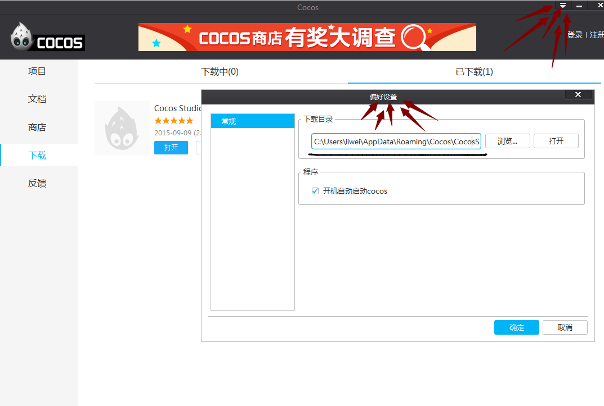
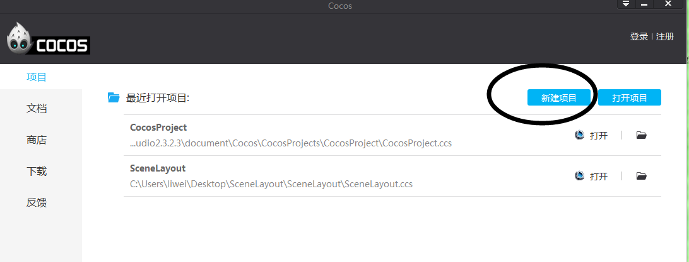
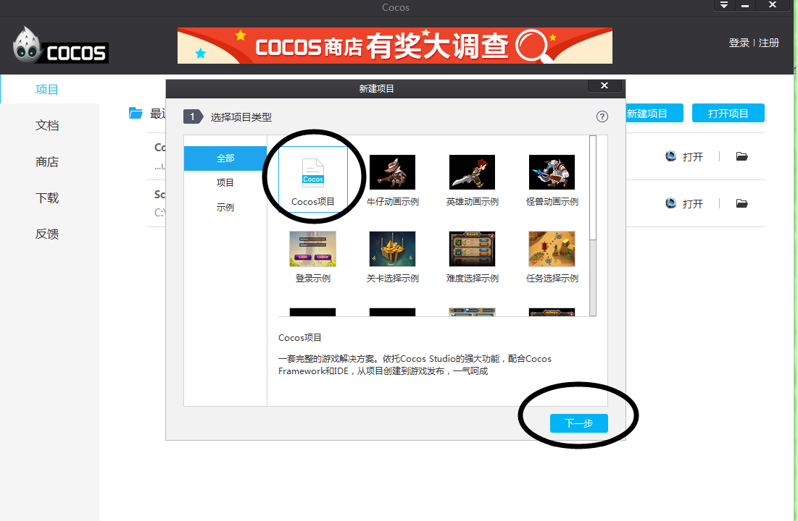
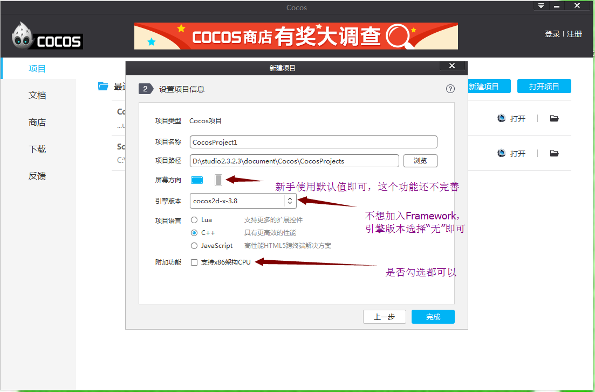
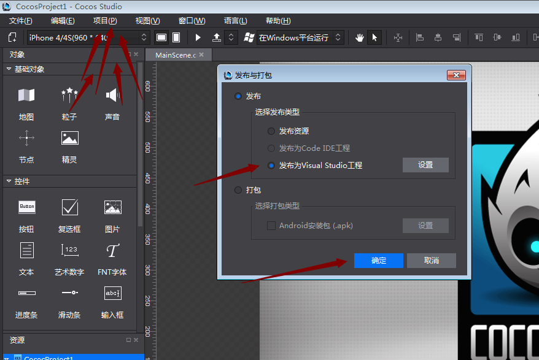

#如何使用Cocos Framework？
###Framework和2dx源碼的區別
&emsp;&emsp;Framework是一個cocos2dx的預編譯庫，所以在功能與API上與cocos2dx是一致的。相比來說，因為是預編譯庫，所以在開發編譯你的專案時會節省大量編譯時間，特別是對於C++專案，如果有用過VS來編譯cocos2dx的項目的話對編譯時間應該深有體會。同時也因為是預編譯庫，在用於開發時，我們無法對cocos的源碼進行中斷點調試，並且也不能改動cocos的源碼（但之framework3.7之後已提供自行編譯framework的方式來允許使用者改動cocos的源碼）。以上是二者的主要不同點。

###Framework的簡略使用步驟

其實，Framework的使用步驟很簡單，之所以有這個簡略使用步驟，是怕浪費大家的時間。廢話少說，步驟如下：

&emsp;&emsp;1、下載framework，cocos商店可以下載

&emsp;&emsp;2、安裝framework（注意路徑不要有空格和特殊字元，可改變預設路徑）

&emsp;&emsp;3、重新開機cocos（要關閉電腦螢幕右下角的launcher）

&emsp;&emsp;4、新建專案、選擇framework版本、語言等

&emsp;&emsp;5、發佈項目到VS

###Framework的詳細使用步驟

####哪裡下載Framework

&emsp;&emsp;目前只能從Cocos商店下載（從2.3.2.3版本開始，Cocos有兩個安裝包：帶Framework的Cocos安裝包和不帶Framework的Cocos安裝包）
 

&emsp;&emsp;第一種搜索方式（如上圖）：商店---工具----Cocos 框架，選擇Framework---立即下載。這種搜索方式只會出現最新的Framework版本。

 

&emsp;&emsp;第二種搜索方式（如上圖）：直接在右上角搜索“Framework”，點擊搜索。這種搜索方式會出現所有可下載的Framework。

###Framework的安裝

&emsp;&emsp;下載過Framework後，開始安裝，同樣有兩種安裝方式。（我習慣用第二種安裝方式）

&emsp;&emsp;第一種：自動安裝。在Cocos Launcher中，選擇“下載”、“已下載”，找到你下載的Framework，點擊“安裝”，下一步、下一步、直到安裝完畢。
 
 

&emsp;&emsp;第二種（如上圖）：手動安裝。Cocos Launcher右上角有個設置下載路徑的地方，找到硬碟路徑並打開，會有一個Framework的安裝包，點擊安裝、並一步一步走下去就行。（ps：如果要自訂路徑，那麼記住路徑不要有中文和空格等特殊字元）

###使用Framework創建專案並運行
 
 

&emsp;&emsp;使用Framework創建專案之前，要先關閉Cocos，如上圖

&emsp;&emsp;創建Framework專案並發佈到VS的步驟為下圖所示：

 

 

 

    Ps：注意路徑不要有中文和空格等特殊字元

 

&emsp;&emsp;發佈到VS後，點擊運行或F5即可運行出這個介面。
 
 
