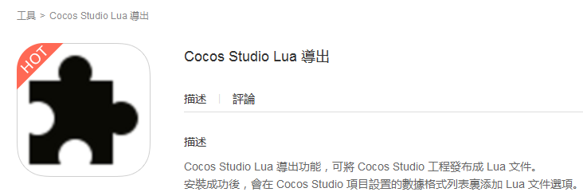

# **如何解決Lua匯出外掛程式更新不成功？** #

注意，以下的描述只針對更新，如果您之前沒有安裝過，下文對您是沒有幫助的。

之前下載了 “Lua匯出外掛程式，就是目前商店裡的那個，見下圖：

    

更新沒有成功，解決方法如下所示： 
     
1、在%userprofile%\AppData\Roaming\Cocos\CocosStore裡找到下載下來的壓縮包，就是LuaPublish.zip。解壓。 

2、將解壓的目錄 LuaPublish 拷貝到%userprofile%\Documents\Cocos\CocosStudio2\Addins目錄裡。到這個目錄裡你會發現已經有一個同名的目錄了，刪除之。如果刪不掉，顯示該檔目前是被佔用了。請退出cocos和Cocos Studio之後粘貼。 
    
3、成功粘貼後，大功告成。 
 
