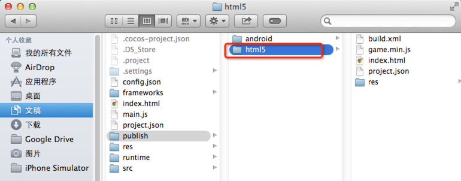
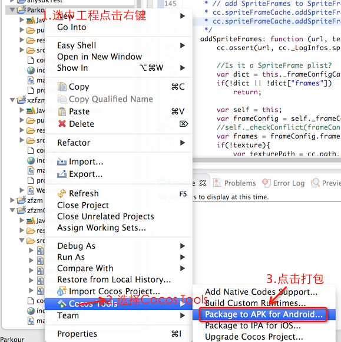
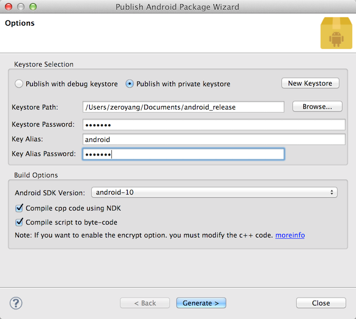
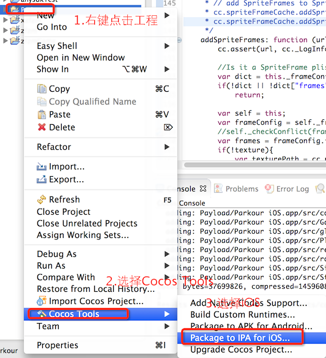
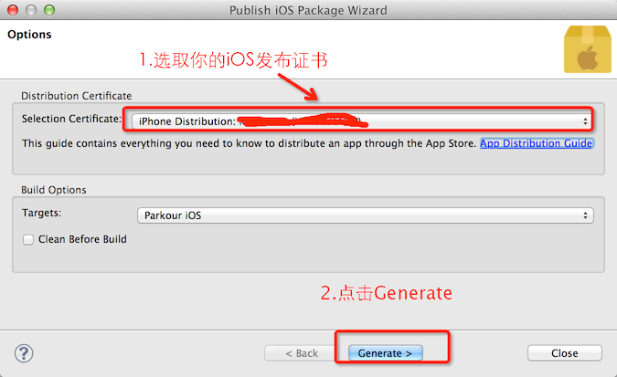
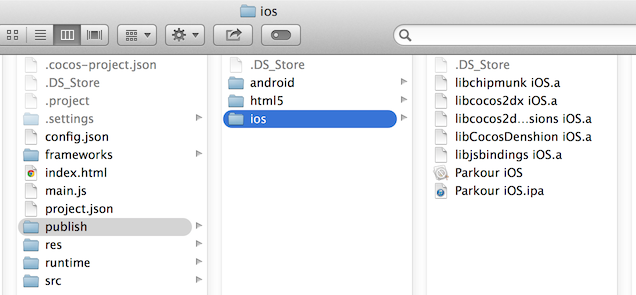

#跑酷游戏打包

我们的跑酷游戏完成得差不多了，是时候打包发布，让更多玩家来玩我们制作的游戏。

##简介

在这节教程中，我将向你们介绍如何打包支持更多的平台和js文件的加密。

##具体内容

###web打包

我们可以将跑酷游戏打包到web平台，将打包好的内容部署到服务器通过web方式发布！

Cocos Code IDE中，没有直接提供打包发布web的菜单，不用担心，我们可以使用`cocos compile`命令进行打包。

例如：

```
cocos compile -p web -m release 
Running command: compile
Building mode: release
running: '/Users/zeroyang/Documents/apache-ant-1.9.3/bin/ant -f /Users/zeroyang/Documents/cocos/Parkour/publish/html5/build.xml'

Buildfile: /Users/zeroyang/Documents/cocos/Parkour/publish/html5/build.xml

compile:
   [jscomp] Compiling 139 file(s) with 40 extern(s)
   [jscomp] 0 error(s), 0 warning(s)

BUILD SUCCESSFUL
Total time: 20 seconds
```
打包生成发布文件位置：



将打包好的html5文件加部署到服务器，然后告诉玩家地址即可。

###android打包

Cocos Code IDE中，已经为我们提供了打包 Android apk的菜单。我们可以直接通过Cocos Code IDE打包生成Android apk。

操作如下：





在打包提示界面，Android需要设置keystore，可以选取已有的keystore或者点击New keystore生成。

打包结果：


我们可以将打包好的apk包安装到手机上运行，或者发布到应用商店，让更多的用户可以玩我们的游戏。

###iOS打包

同样，Cocos Code IDE提供了直接打包 iOS package的菜单。我们可以直接通过Cocos Code IDE打包生成IOS的 IPA包。

操作如下：



在打包提示界面，iOS需要设置发布证书。 可以参考[App Distribution Guide](https://developer.apple.com/library/ios/documentation/IDEs/Conceptual/AppDistributionGuide/Introduction/Introduction.html)


打包结果：


打包好的IPA包可以通过 apple store 发布，让更多玩家可以玩我们的跑酷游戏！